# How the Human Brain Perceives Our Surroundings

## The Human Brain and Data Visualization

Getting the most from data visualization begins with knowing a few essentials about how the human brain operates. Keeping these attributes  of the brain in mind along with the design approaches to address them is the foundation of design and perception concepts applied to data visualization. 

- Most of humain brain is devoted to visual processing - fast visual processing. This need for speed could tip the balance between life and death. 
- The impulse to detect, match and make sense of patterns is so strong that many of us do it not only for practical purposes, but also as a form of pure play in many games;
- A core part of data visualization design involves repurposing our innate visual abilities to adapt to a worl that's flooding with data. We are better at detecting and interpreting patterns and features in data if they are presented in a well executed visualization rather than a tabular format; 
- A key step in unlocking the power of data visualization is a process of visual encoding: that is, assigning visual attributes such as color and shape to different types of data; 
  - This process translate data into a visual shorthand (visual code) that people are good at decoding; 
  - There is many encoding options in the visualization toolbox and part of ur job is to find the right mix of these options and balance to clarify the data for users; 
- There are a variety of visual cues that pop out at us without conscious effort (**pre-attentive attributes**); 
- Let's take a look at these sets of candy lozenges for pop-out effect example including color, shape, position and others. You may find that the one different element in each set of pop-outs almost immediately without any conscience effort; 
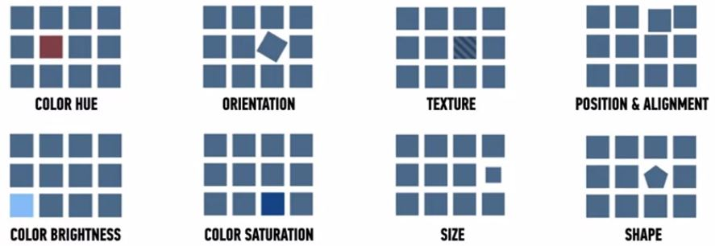
- Encoding provides great raw materials for display, but you also need to think about assembling those elements in ways that truly help people think clearly and accurately about what they are seeing;

## Cognitive vs Perceptual Design Distinction
- As a data visualization designer, you need to think about using design elements to help people interpret visulizations as intented;
- There are two fundamental systems of the brain that drive how we think and make judgments: 
  - Automatic and immediate perception: such as noticing an unusual pattern of movement in the bushes;
  - Slower and more deliberate cognition: such as thinking about the meaning of certain sensory cues; 
- Example: 
  
  - System 1: an analyst might immediately notice a single dot sitting alone but nearly to a cluster of other dots in a scatter plot; 
  - System 2: if the analyst spends a few moments considering a bad data as a meaningful outlier with further investigation; 
- Confronting a large set of multidimensional data can be overhelming: your task is to create a way to encode that data so that they can be put together like letters into words or like Lego bricks into meaningful patterns that work with both perceptual and cognitive systems; 
- Making good choices for combining various encoding option for effect: the visualization is both an art and a science
  
- In a trade off of speed versus accuracy of perception, speed often wins. In the case of the unknown movement in the bushes, the value of instant action outweighed accuracy. Fro a survival point of view, it was better to react quickly even if there are many false alarms in the process. The brain relies on some shortcuts and assumptions to help make our perception rapid. 

# Getting Started in Effective and Ineffective Visuals

## Introduction of Effective and Ineffective Visuals

How to choose the right visualization ?
- One of the challenges with doing visualizations is actually being able to decide what is the best visualization for the type of data;
- Knowing the intent or purpose of a particulare visual and its advantages and disadvantages will help inform the decision;

We need to learn:
- Identify various types of visualizations in Tableau
- Discuss the role of ethics in developing a data visualization 
- Examine and improve ineffective visualization 

## Types of Visualizations 
In this section, we will discuss the types of visualizations that are available to you and you will be able to recognize and identify them when you start to do your own visualizations. 

### Text or number visualization
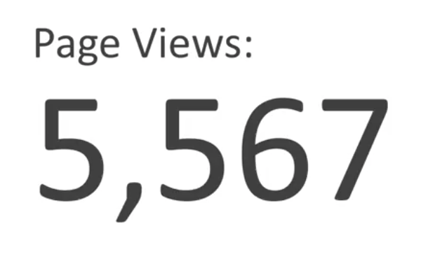
- It's very effective if what you're trying to show is something very high-level as part of an overall dashboard package. 
- This simple text conveys exactly what you need and has the information all contained with it, and is quite widely used as a KPI or key performance indicator. 

### Table visualization 
- Tables convey a lot of information 
  - The 2x2 table has a lot of power in terms of what it can convey and in terms of looking at comparisons across categories; 
- Too big = less effective: if there are a lot of information, it's too overwhelming for a big Powerpoint presentation especially for a public presentation or something that you're doing for a big audience; 
- Table is best used when there is a mixed audience that will need to view you visualization: each member of the audience might be interested in the specific row or specific set of data; 
- There is also specific or different units of measurements and it's sometimes easier to show it in a table;  

### Heat map - Cross-tabulation 
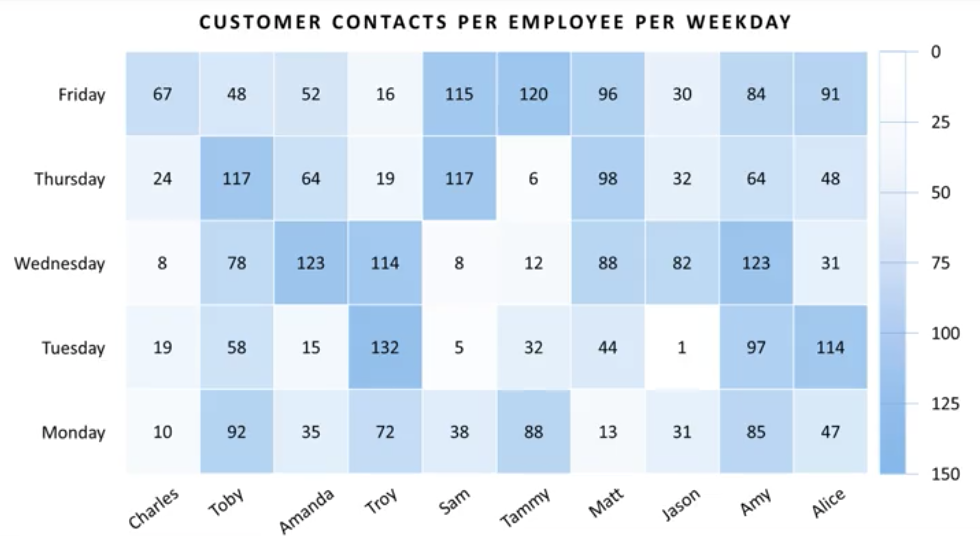
- Using color to visually emphasize information based on a certain set of parameters; 
  - For example, it can identify the top N in some category or the bottom of some category. 

### Scatter plots
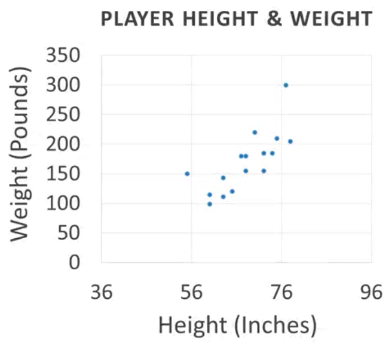
- If you have a lot of information and it's in a forum that's sort of a continuous variable which is data could take on any number and you're comparing them with another set of numbers: Scatter plot is the best way to see if there's any inference that you can draw in the relationships or the correlation between the two variables. 
  - You plot them on an x and y-axis and see if there's some sort of connection between the two or perhaps there's some sort of clustering that you can find relationships with when you're drawing a scatter plot;
- Exemple
  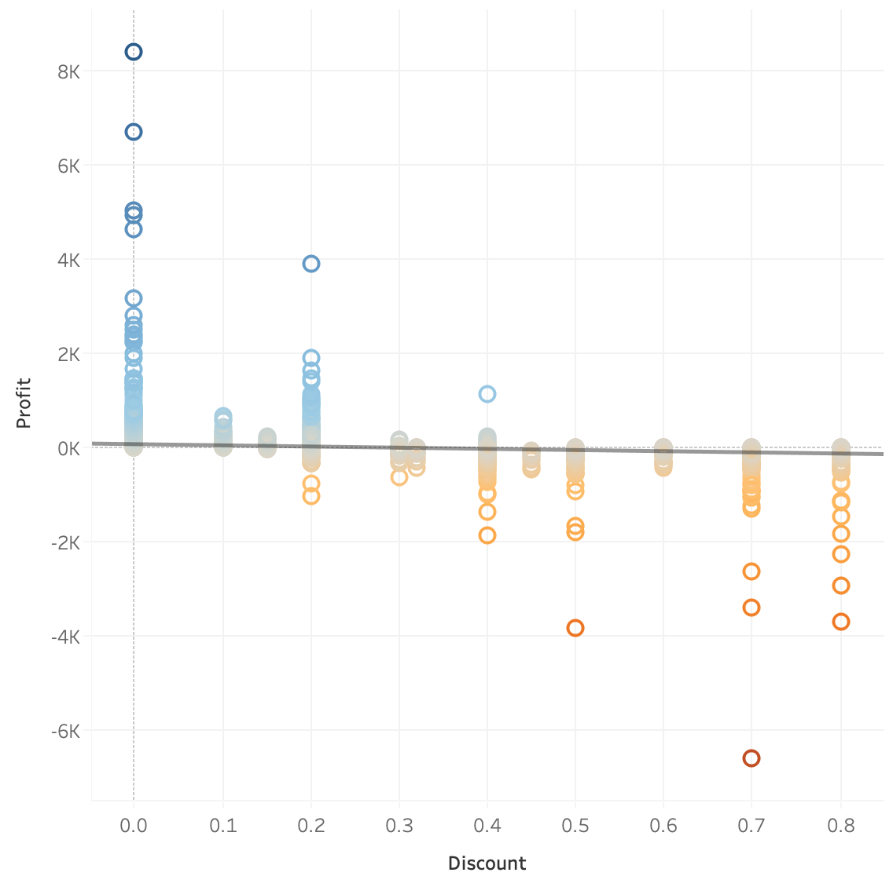
  - Trend line: a line that shows a weak negative correlation between discount and profit; 
  - The implication here is that the deeper the discount was the less profitable the sale was;
  - it shows also that there is a point at which giving discount many sell more but it's at the cost of profits, and if you're in a for-profit business, profits are what it's all about; 

### Line graphs
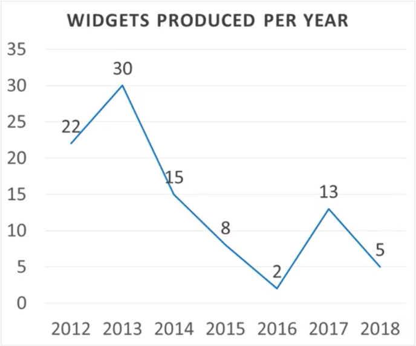
- It's used quite extensively when visualizing data across time. 
  - If you have any time variable, one of the first things you ought to do is to do a simple line graph and see how well you can see if there's a trend; 
  - Perhaps you can get into some forecasting to see really where the data may be headed in the future

### Bar graphs 
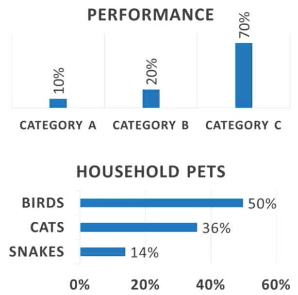
- Vertical, horizontal and stacked are three common types of bar graphs
  - Stacked version allows you to see clearly if one category is substantially bigger than the other
- It's based on how much information you are trying to convey as to whether you put it in. 

### Waterfall graphs
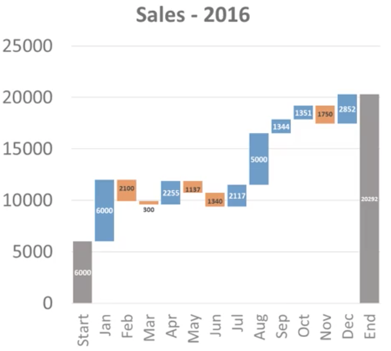
- a fancier version of a bar graph allow you to really be able to quickly see the areas and to be able to answer questions very quickly and easily;

### Map visualization
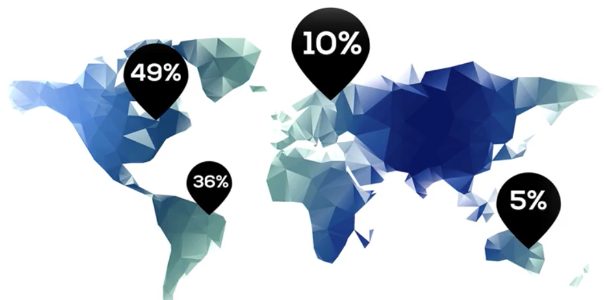
- Map is crucial for spatial analysis; 
- It's used with spatial components, geography, latitude and longitude data;

### Pie charts
- It's not "easy as pie" and have bad reputation
- Useful in certain specific instances

## Practicing Good Ethics in Data Visualization
- Ethics are rules of behavior based on ideas about what is morally good and bad
- Example: we'll look at a graph from a news broadcast, we call them Nosy News for purposes of this example. Noisy News has a particular point of view and that is reflected in this graph. 
  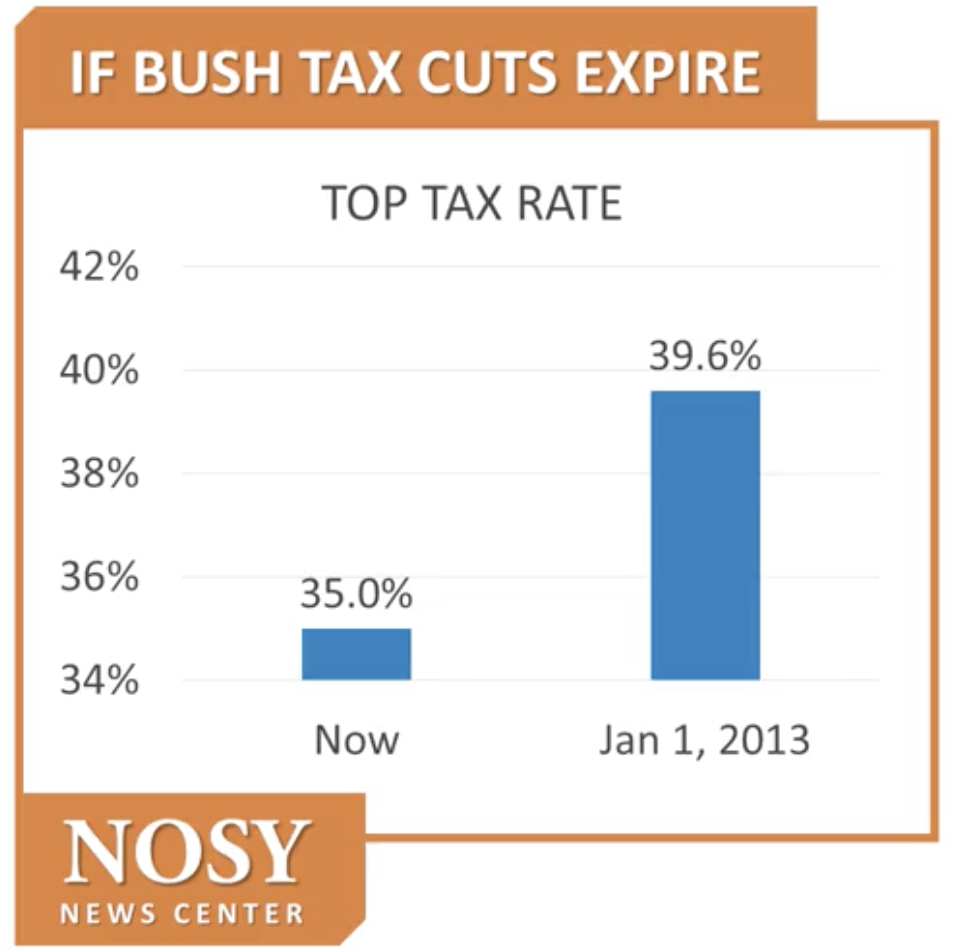
  - They use a standard bar chart which is easy for us because our eyes tend to compare the enpoints of the bars. 
  - If we redo the graph having a non-zero baseline and it starts at the bottom, the graph'll be skewed: **bar chart traditionally have 0 as the baseline** and it's standard so that people are able to compare from that baseline. 
  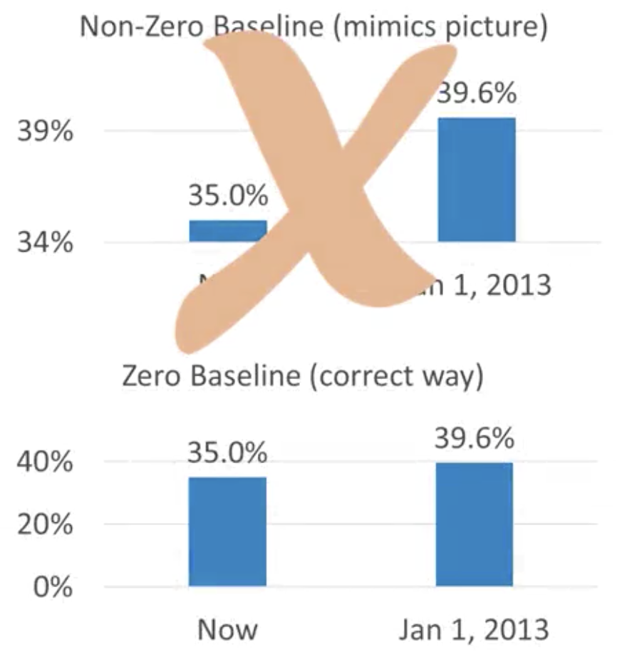
  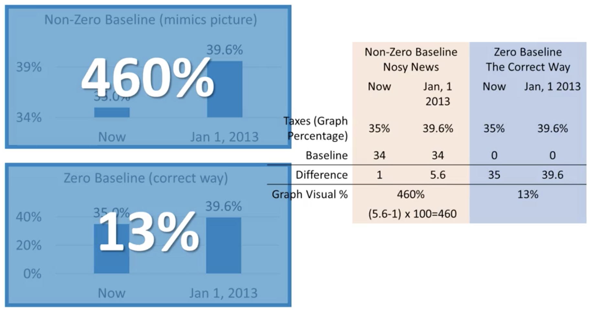
  - The non-zero baseline bar char misleads the user and reduces the credibility of the new outlet
- Example 2: this is a look at the data from gun deaths after Florida enacted a law that permit a gun owner to shoot someone anywhere if the gun owner feels that deadly force is needed: Did you assume that there was a sharp decrease of gun death after 2005?
  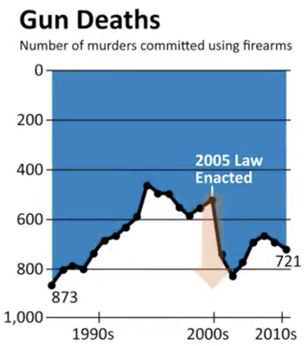
  - In fact, it's the opposite: you have to check out the axis on the left, the y-axis, 0 is at the top and 1000 is at the bottom, which is the opposite to how graphs are typically drawn. Frankly, it's unethical: **inverting the axis misleads the reader**
  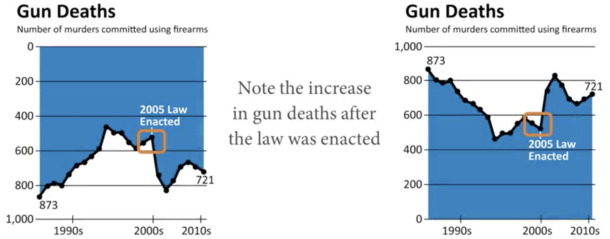
- Ethics rules: 
  - User should not have to deviate from the traditional way of displaying graphs 
  - If there is a deviation, it should be made clear and not just on the axis
- Beside of bar chart, pie chart is probably the most widely used visualization. It looks like at first glance a great way to show percentage but you must be carrefuf, the pie chart should only be used for only the most narrow circumastances. 
- Here are two simple charts using exactly the same data
  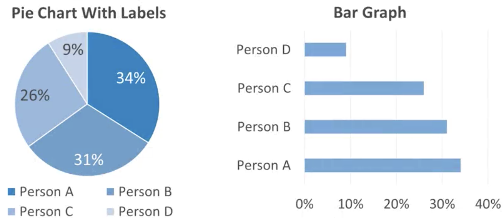
  - Even with the numbers and the labels, Person A, B and C seem to have roughly the same percentage based on the side of the pie slice; 
  - Now focus your eyes on the bar graph, it's evident very quickly that Person A has the highest percentage and that it's actually notably higher than Person C, event without any strategic use of color. **Bar chart is more clearly distinguish**;

## Ineffective Visuals and How to Improve Them
In this section, we'll examin examples of ineffective visuals, especially determine why they might be ineffective and how we can fix them. 
- Example 1: it's about a charity sporting event in 2015 published by firm that organize such events. They're attempting to document how much money they raised online for cycling, walking and running charity events. 
  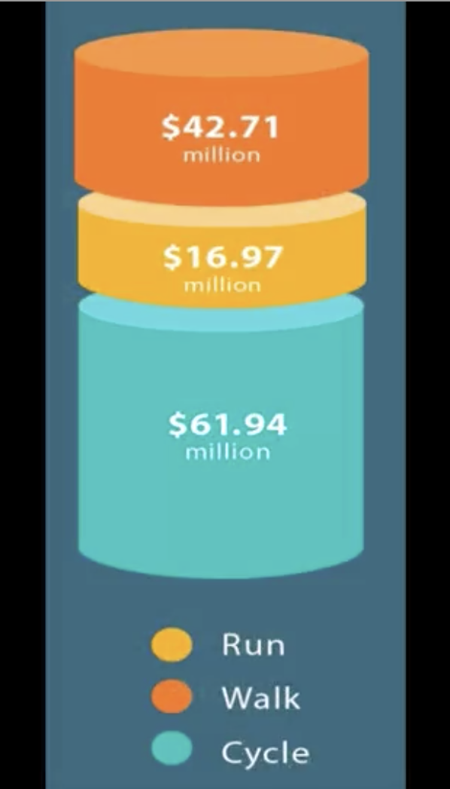
  - As you look at this visualization, first I want to talk about data and the premises we're missing. The data is problematic: did the company do more cycling events that resulted in more fundraising? Or was it that cycling event raise more money? That's crucial because if there was only 2 walking events but 10 cycling events then the amount raised per event is very different than the total amount raised. It's sad about the **lack of data context**
  - For the graphic itself, it's pretty, and it clearly differentiates between the 3 types of events. But as you know, it's not really recommended to use 3D visualization to plot two dimensions. It really skews our perception of data. In our data, cycling made more than running and walking combined but that's not really how it seems in the graphic. 
  - Bar chart helps us to improve this visualization
  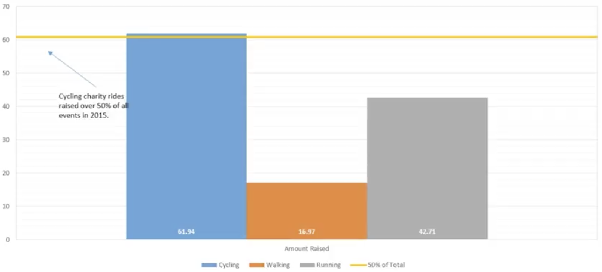
  - Bar chart leads us to take a quick look at the data. But there's more insight. With one change, we can show the cycling event not only raise lots of money, those events raise more than running and walking combined. 
  - With just making a small tweak to the bar graph by adding a line to show that, the bar graph is slightly above the 50% mark, we can see a significant difference between cycling events and the other event. 
- Example 2: Several states in the United States have legalized marijuana for recreational use. The result has been increased tax revenue and for our purposes, lots of graphics that use marijuana leaves to represent data. 
  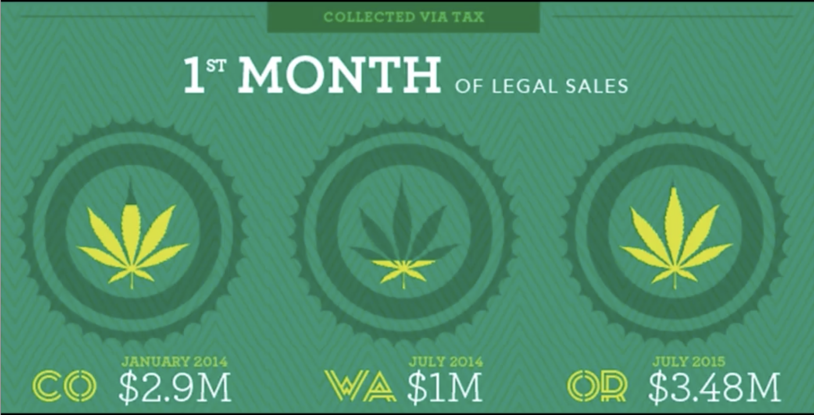
  - First off, we don't have any information about the taxe rate in each state
  - Secondly, with this visualization, we have so many questions about: the population of the state, the amount of purchases of marijuana in the first month, different regulatory rules in place in the three different states, and it would've been interesting to see the tax revenue per ounce of marijuana sold. 
  - For the purposes of contextualizing the information, we change this visualization by adding a simple but effective table. It conveys the information in much more accurate and effective way. 
  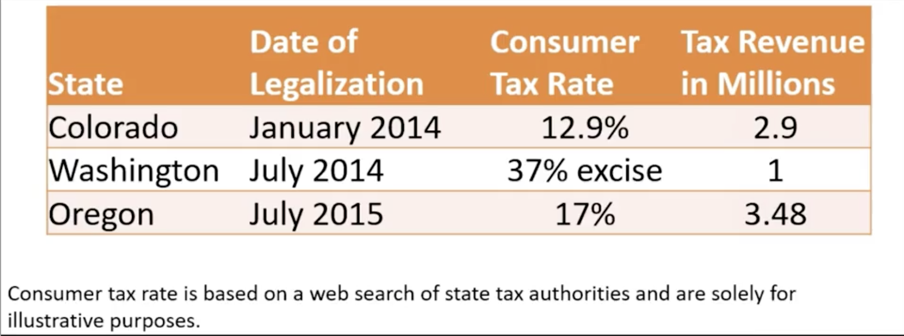 