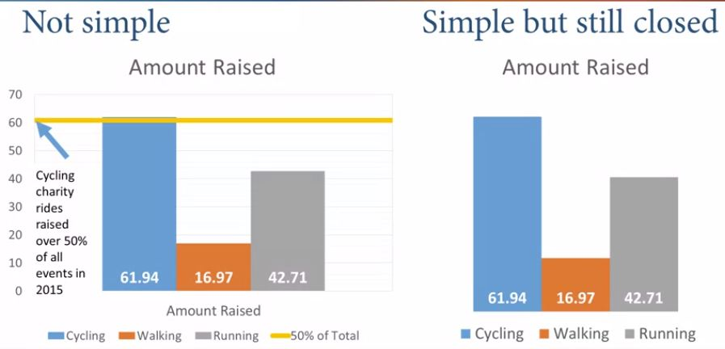

# Visual Perception and Cognitive Principles Introduction

In this section, we'll focus on: 
- Define cognitive load and clutter;
- Illustrate the principles of visual perception
- Use contrast in visualization 
- Define and use pre-attentive attributes 
- Declutter visualization

## Cognitive load and clutter
- ***Cognitive*** load is the amount of mental effort required to interpret information. For data visualization, we need to learn how to minimize the cognitive load while also communicating the message accurately. There are 3 types of cognitive load: Intrinsic, Extraneous and Germane
  - **Intrinsic Cognitive** load is the amount of memory that we need to understand something. Different tasks requires different amounts of thought and attention;
  - **Extraneous Cognitive** load relates to how information is presented; Poor design require more effort to identify problem and create a mental image;
  - **Germane Cognitive** load is the way for the brain to look for patterns to develop context of visualization for late reference. It's to help tak a cognitive issue and present it in an easy and meaningful way;
- ***Clutter*** is one of those things that we know when we see it. For data visualization, it's about determining what need to be in a visualization and doesn't need to be in the visualization to reduce the clutter: Clutter is all the things you remove while still preserving key ideas; 
  - The reason we want to reduce clutter is so that we can minimize cognitive load of the reader of the data visualization. Less clutter means more effective visualizations; 
  - How would remove the clutter and what could have been done differently? 
  
    - 3D effect: let's not do that unless you're graphing three dimensionally
    - Dark grid lines: dark grid lines are really helpful if it's going to aid in the visualiation itself
    - Overuse of bright and bold colors 
    - There is no apparent sorting of the data being shown 
    - An unhelpful axis
  - 3D doesn't improve a visualization: Skews information and Adds confusion; 
  - Something is cluttered doesn't mean it shouldn't be there. Redundancy (clutter) can help users manage cognitive load. Sometime, it nonetheless helps with the cognitive load: 
    - Currency symbols
    - Percent signs 
    - Commas within numbers 
    - Scientific notation
  - Some details many add clarity (but sometime clutter). Clarity reduces the effort required to comprehend complex data; 

  ## Principles of Visual Perception
  - In this section, we'll illutrate 6 of Gestalt principles of Visual Perception and apply these principles to future visualizations; 
  - Evaluating how the brain perceive the world is learning how to organize the visualization to be effective at conveying information; 
  - There are 6 principles: 1- Proximity; 2- Similarity; 3- Enclosure; 4- Closure; 5- Continuity; 6- Connection; 
    
    - **Proximity** is when elements are placed close together allowing them to be perceived by our mind as a group and belonging together; 
    
    - **Similarity** when we naturally group similar looking items. This is especially useful in scatter plots with different categories; 
    
    - **Enclosure** uses colors and bouderies to highlight or contrast information. It's also another way to depict groups. On the visualization bellow, values to the left and right of the grayed areas means something discrete: those on the left are in one group, those on the right are on the other group: Notice how your mind's eyes can clearly differentiate between two groups. 
    
    - **Closure** is the mind's ability to fill in gaps. Users must have enough essential information to be able to fill the gaps. It's the acceptance of the premise that people like to keeps things as simple as possible as long as it fits the existing construct that's in our head. We can fill in the gaps if we're used to seeing it. 
    
       - The bar graph works without any axis because the bars are aligned on the bottom. The visualization on the left and the visualization on the right both meet the closure threshold. And the reason they both follow the closure principles is because our mind doesn't need the complete border, the axis or whatever to be able to discern meaning from them. 
    - This chart shows continuity: the bar graph still works without any axis at all because the bars are lined up on the invisible axis. If there is a perception that the bars weren't lined up on the axis, then one would need to be shown but in this case, they are all even. 
    
    - **Connectivity** means that things are connected and related to one-another. Virtually, any line graph describes the connection principle well. 
    
- Clarity reduces user's cognitive load. 