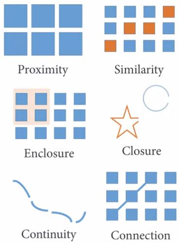

# Visual Perception and Cognitive Principles Introduction

In this section, we'll focus on: 
- Define cognitive load and clutter;
- Illustrate the principles of visual perception
- Use contrast in visualization 
- Define and use pre-attentive attributes 
- Declutter visualization

## Cognitive load and clutter
- ***Cognitive*** load is the amount of mental effort required to interpret information. For data visualization, we need to learn how to minimize the cognitive load while also communicating the message accurately. There are 3 types of cognitive load: Intrinsic, Extraneous and Germane
  - **Intrinsic Cognitive** load is the amount of memory that we need to understand something. Different tasks requires different amounts of thought and attention;
  - **Extraneous Cognitive** load relates to how information is presented; Poor design require more effort to identify problem and create a mental image;
  - **Germane Cognitive** load is the way for the brain to look for patterns to develop context of visualization for late reference. It's to help tak a cognitive issue and present it in an easy and meaningful way;
- ***Clutter*** is one of those things that we know when we see it. For data visualization, it's about determining what need to be in a visualization and doesn't need to be in the visualization to reduce the clutter: Clutter is all the things you remove while still preserving key ideas; 
  - The reason we want to reduce clutter is so that we can minimize cognitive load of the reader of the data visualization. Less clutter means more effective visualizations; 
  - How would remove the clutter and what could have been done differently? 
  
    - 3D effect: let's not do that unless you're graphing three dimensionally
    - Dark grid lines: dark grid lines are really helpful if it's going to aid in the visualiation itself
    - Overuse of bright and bold colors 
    - There is no apparent sorting of the data being shown 
    - An unhelpful axis
  - 3D doesn't improve a visualization: Skews information and Adds confusion; 
  - Something is cluttered doesn't mean it shouldn't be there. Redundancy (clutter) can help users manage cognitive load. Sometime, it nonetheless helps with the cognitive load: 
    - Currency symbols
    - Percent signs 
    - Commas within numbers 
    - Scientific notation
  - Some details many add clarity (but sometime clutter). Clarity reduces the effort required to comprehend complex data; 

  ## Principles of Visual Perception
  - In this section, we'll illutrate 6 of Gestalt principles of Visual Perception and apply these principles to future visualizations; 
  - Evaluating how the brain perceive the world is learning how to organize the visualization to be effective at conveying information; 
  - There are 6 principles: 1- Proximity; 2- Similarity; 3- Enclosure; 4- Closure; 5- Continuity; 6- Connection; 
    
    - **Proximity** is when elements are placed close together allowing them to be perceived by our mind as a group and belonging together; 
    
    - **Similarity** when we naturally group similar looking items. This is especially useful in scatter plots with different categories; 
    
    - **Enclosure** uses colors and bouderies to highlight or contrast information. It's also another way to depict groups. On the visualization bellow, values to the left and right of the grayed areas means something discrete: those on the left are in one group, those on the right are on the other group: Notice how your mind's eyes can clearly differentiate between two groups. 
    
    - **Closure** is the mind's ability to fill in gaps. Users must have enough essential information to be able to fill the gaps. It's the acceptance of the premise that people like to keeps things as simple as possible as long as it fits the existing construct that's in our head. We can fill in the gaps if we're used to seeing it. 
    
       - The bar graph works without any axis because the bars are aligned on the bottom. The visualization on the left and the visualization on the right both meet the closure threshold. And the reason they both follow the closure principles is because our mind doesn't need the complete border, the axis or whatever to be able to discern meaning from them. 
    - This chart shows continuity: the bar graph still works without any axis at all because the bars are lined up on the invisible axis. If there is a perception that the bars weren't lined up on the axis, then one would need to be shown but in this case, they are all even. 
    
    - **Connectivity** means that things are connected and related to one-another. Virtually, any line graph describes the connection principle well. 
    
- Clarity reduces user's cognitive load. 

## Strategic Use of Contrast
- Contrast visualization that have all information, but is too cluttered for the audience to see. In this section, we'll see how to recognize and apply contrast principles to visualization; 
- We work up a small fictional data set from a comparative study of survey results from 6 colleges across the US. The survey results are in and there's a weighted index for all the question based on 5 categories: 
  
  - The weighted performance index is the only data that the survey administrator gave you. In other words, it's a pre-calculated metric that summarizes all of the data: the lower the number, the worse the performance is, the higher number, the better the performance is. 
  - It's straghtforward to graph the results as I've done: 
  
  - The reason it's interesting is that all of the information is in on spot and on chart so you can do some comparisons. 
  - Interesting but not effective: all of the information is there, but it's just very difficult to figure out. Plus, some of the values, and I think that's where the issue with the hours, the blue diamond is. Some of the value are very similar to others so I can't tell those that almost have the same scores as others. 
  - Here is one way to improve the visualization
  
  - The solution is using the contrast to be able to identify exactly what we need to identify for our needs and eliminate clutter and minimize the cognitive load: We don't expect that the reader of this visualization know well the data as you know. The user experience must be to get at the data quickly so that they can do their job and make decisions based on the information you provide. 
- The information given was not a raw data, but was indexed to allow comparisons across colleges. We all love raw data, but if we're comparing competitors, we'll often only be given a small amount of information, because they don't want to reveal raw data from other institutions; 
- But because it's indexed informaiton, we can carefully re-index this to meet our needs - comparisons using another index; 
  
  - The index was based on a scale from (-1,5) to (+1,5). By adding (1,5) to every one of th values, the index is rescaled that the lowest you can go is 0 and the highest you can go is (3): that keeps every measure at the same relative level (positive); 
  - Instead of this sort of quasi scatter plot that I did for the previous graph, I'm going to use a horizontal bar graph. It's the best graph at really being able to quickly see differences between categories of informations. 
  
  - But there's really no contrast here, it's all just a bunch of different colors. What we want to know is how we, in our college, are doing vs the other colleges, so that I put A, B, C, D and E in gray and our college is a green, and it's always at the top. It's not ordered based on the largest or smallest or alphabetical order: our college followed by E, D, C, B, A; 
  
  - The text added is important because the values are often fairly close together. But it gives you very quick snap shot of information and it allows the consumer of the information to say: okay, we have this information, and we can address it instead of saying, what it this data saying? It really moves us into the actionable type of information; 

## Pre-attentive Attributes of Visualization
In this section, we learn how to identify and use pre-attentive attributes in your visualization
- Pre-attentive attributes are a way to get the brain to immediately focus on certain aspects of a visualization; 
- There are 3 types of memory: iconic, short-term, long-term
  - If we want to get something in the reader's brain without them having to think about it then we need to tap the **iconic memory**; Iconic memory is the sense memory of visual images after the images are gone; 
  -  **Short-term memory** is where we deal with the cognitive load. This is the ability to hold information in active memory. 
  -  **Long-term memory** is what we retain for a long period of time. 
- Data visualization works with both sensory and active memory while trying to hit the iconic and short-term memories
- Good visualizations allow readers to see what we want them to see before they know that they have seen it; 
- Draw the eyes of your audience is like change one of these things to focus the user's attention: size, color, shape, orientation, line composition, enclosure, intensity, position; Each of these have their uses depending on what you're visualizing: quantification or categorization;  
  