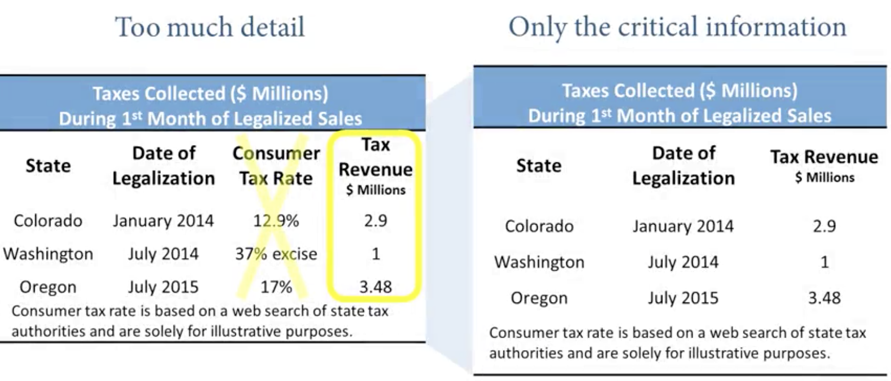
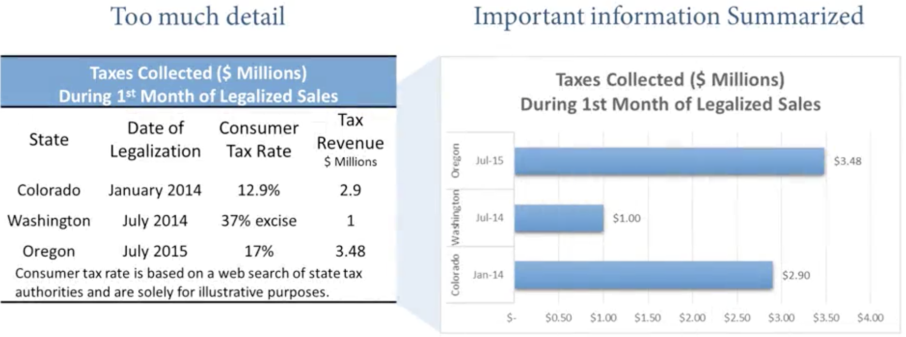
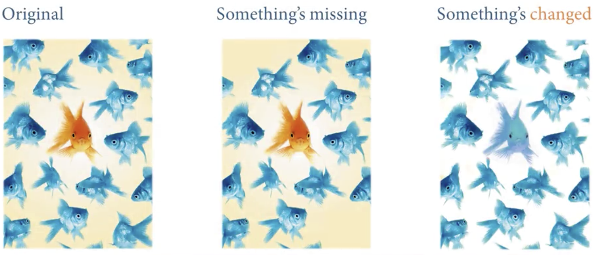
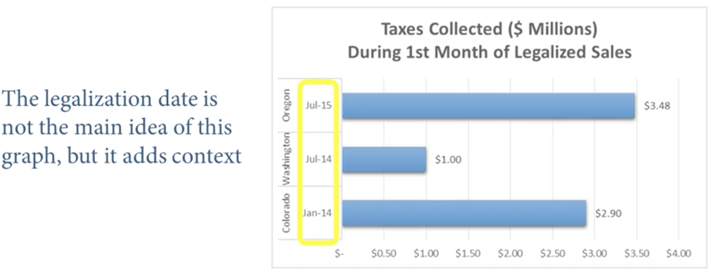
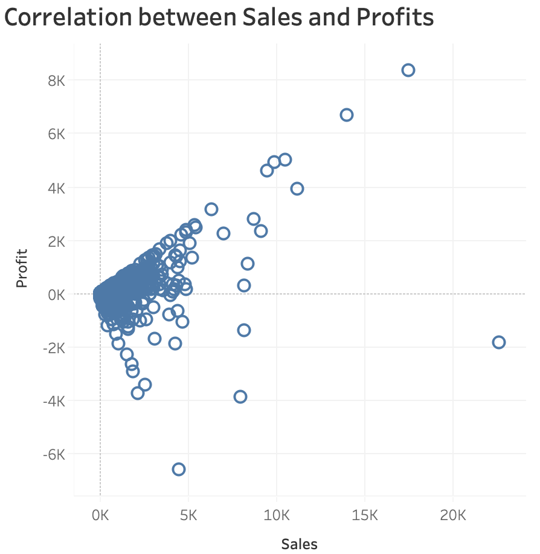
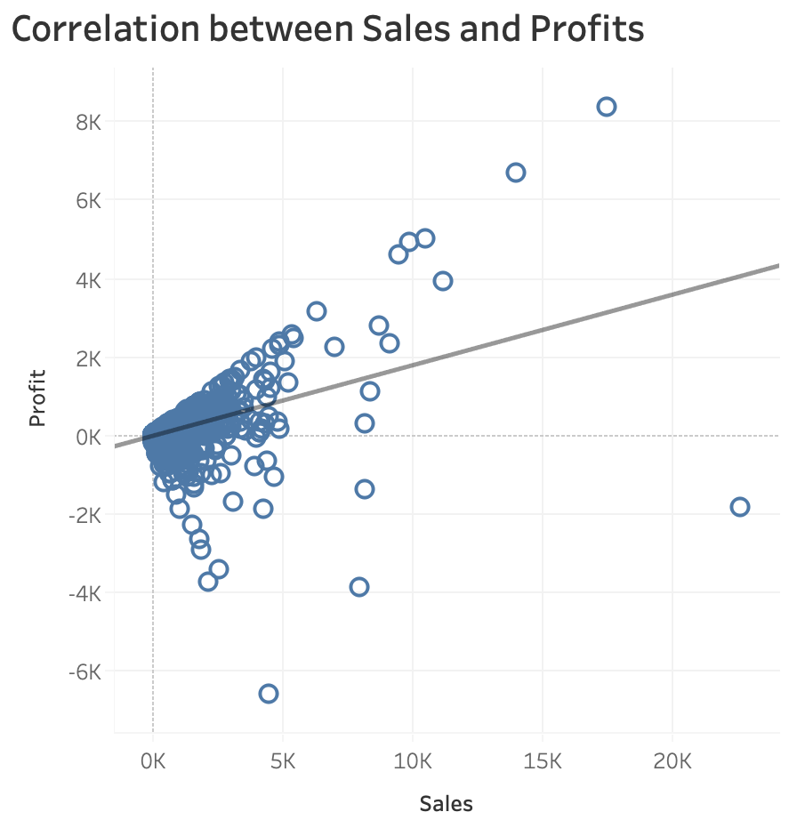
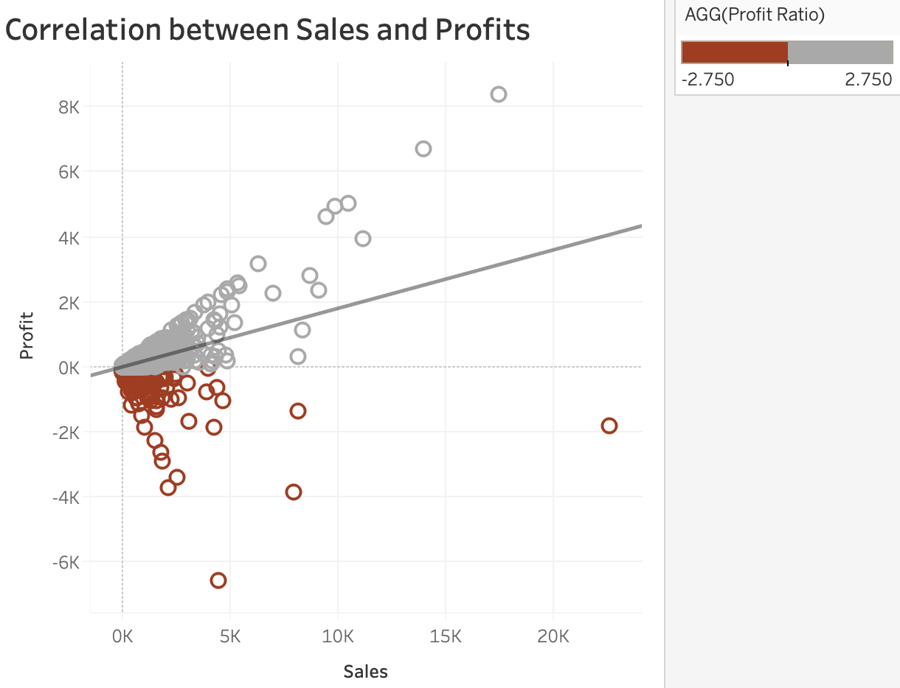
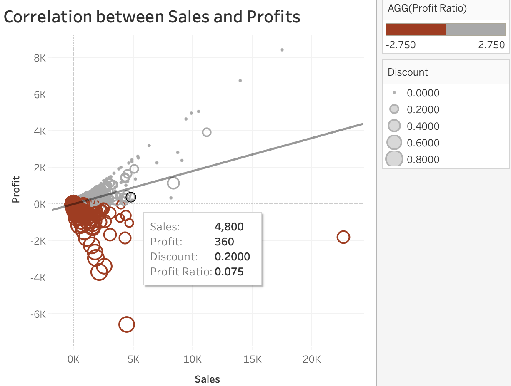

# Design Best Practices

In this section we will cover 3 points: 
- Apply Gestalat principles and pre-attentive attributes 
- Identify and discuss accessibility and aesthetics 
- Apply visualization and tips

## Gestalt principle: Proximity
By the end of this module, you'll be able to recognize how and why a Gestalt principle is being used; 
- Proximity: things close together tend to be more related than things further apart
- Proximity is absolutely fundamental to geographical analysis, spatial statistics and other types of fields related to geography. It's the basic for what's known as spatial interpolation in geographic information system; 
  
- Proximity could be used when you're doing a categorical plot and these categorical scatter plots allows you to look and see if there's any clustering that occurs based on the scatter plot that you draw; 
- Proximity principle implies that there are more relationships to things that are closer to each other than there are further from each other; 

## Leveraging Pre-attentive Attributes
- There are characteristics that we add to visualizations to focus the audience's mind on what should be the first thing that they see - It's first and foremost in our iconic memory (what the mind sees unconsciously before we're attune to what we're seeing in front of us)
- This section will focus on applying storytelling with data principles to visualization using pre-attentive attributes like size and colors and eliminating distractions; 
- Methods to use to help to focus audience's attention on what we want them to see: 
  - not all data are equally important means get rid of the non-critcial information;
  
  - if you don't need the detail, summarize it!
  
  - if you eliminate something, will it change anything? 
  
  - if there is some information that does need to be there, but it's not essential, it can still be there, but it could be in the background. It doesn't have to have the same level of emphasis as the information that is really needed to answer the question at hand; 
  
- Example: In a sample dataset of orders, we would like to know *why sales to certain customers aren't profitable*. There should be a strong correlation between sales and profits. 
  - With the scatter plot bellow, we cannot tell very clearly what the relationship between sales and profits. 
  
  - This trend line is not really helpful mathematically, it shows that there's a positive relationships between sales and profits, but it's not really good enough to show visually. 
  
  - Create a calculated field named "profit ratio" = SUM(Profits)/SUM(Sales) and change the color to show the contrast between the positive and negative numbers (the profits and the losses)
  
  - *"Why sales to certain customers aren't profitable?"*: Customers will get discounts on the merchandise, if you give discounts they boost sales. But if you discount the stuff too much, you sell a lot of stuff, but if the discounts are too high, you sell stuff for a loss; The pre-attentive attribute "size" is used to represent the relationship between discount and profit and sale; 
  
- We used "size" and "color" as pre-attentive attributes in this example but there are another attributes you can use: 
  - Form: length, width, orientation, shape, size, enclosure
  - Color: hue, intensity