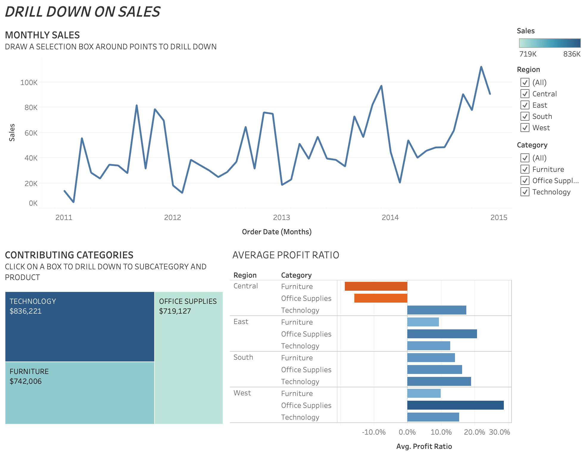
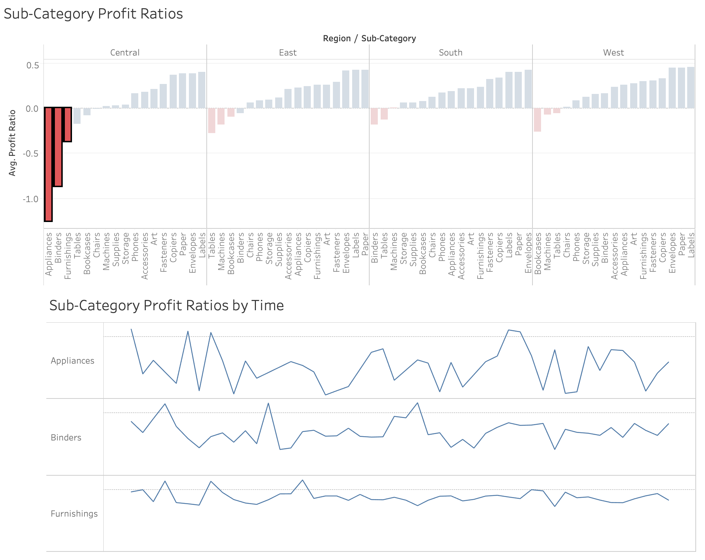

# Coursera Final Assignment: Essential Design Principles for Tableau

**Tableau Public**: 
[Coursera Final Assignment - Essential Design Principles for Tableau](https://public.tableau.com/profile/minh.hieu.pham#!/vizhome/w4-project/Sub-CategoryProfitRatios-Dashboard)
https://public.tableau.com/profile/minh.hieu.pham#!/vizhome/w4-project/Sub-CategoryProfitRatios-Dashboard

In order to complete the assignment, I incorporate nested sorting principles and also highlight the three worst performing elements on a bar chart.

Firstly, let's drill down on sales

- Monthly sales: draw a selection box around points to drill down
- Contributing categories: click on a box to drill down to subcategory and product
- Average profit ratio

Deep dive on average profit ratio by sub-categories 

By selecting one or multiple sub-categories, the profit ratio time serie chart is also updated to anticipate next moves in sales based on trends.

Some commentaries regarding the pre-attentive attributes and the Gestalt principles: 

- Color is used to highlight the worst sale in each region; 
- The similarity is reflected due to the red color of worst sales; 
- There is no difficulty in finding out the worst sales due to highlighting, it's the negligible amount of clutter; 
- This is dynamic visualization, I choose to use the first chart as a filter to mention the specific sub-categories sales trends by time;
- The extra calculation and sorting and memorizing the numbers are a burden. Visuals remain in mind for a long time;  