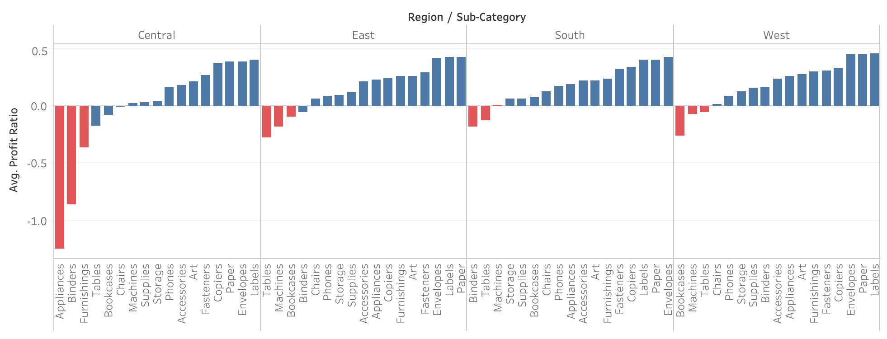
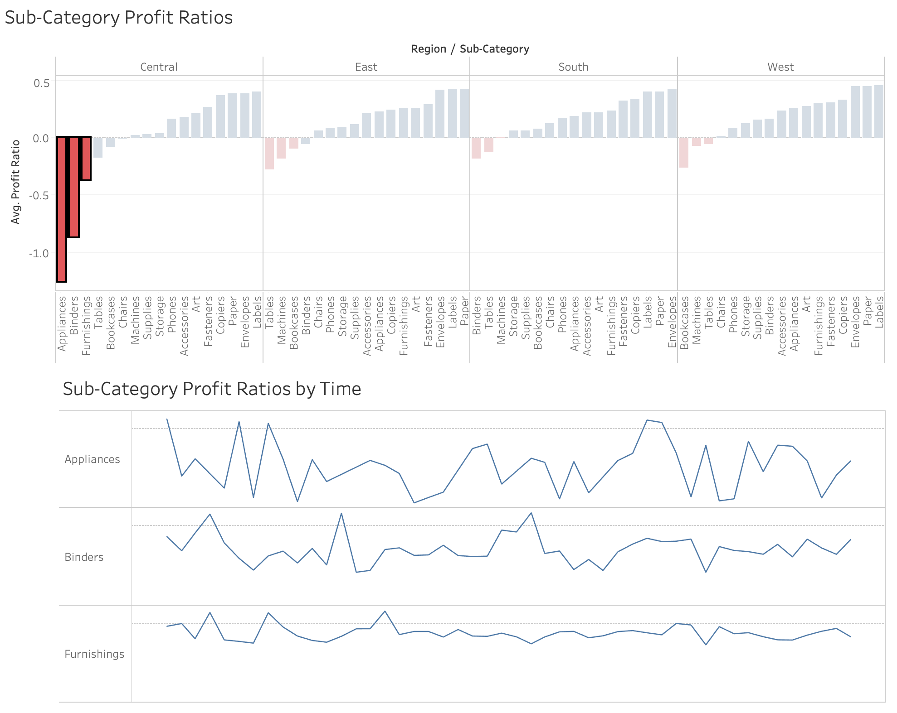

# Coursera Final Assignment: Essential Design Principles for Tableau

**Tableau Public**: 
[Coursera Final Assignment - Essential Design Principles for Tableau](https://public.tableau.com/profile/minh.hieu.pham#!/vizhome/w4-project/Sub-CategoryProfitRatios-Dashboard)
https://public.tableau.com/profile/minh.hieu.pham#!/vizhome/w4-project/Sub-CategoryProfitRatios-Dashboard

**Reference**: [Coursera Final Assignment - Essential Design Principles for Tableau](https://anthonysmoak.com/2017/04/09/essential-design-principles-for-tableau/) 
https://anthonysmoak.com/2017/04/09/essential-design-principles-for-tableau/

Recently completed *Essential Design Principles for Tableau* offered by the University of California Davis on Coursera, Here are some personal reviews. 

- A solid class covering data visualization concepts such as pre-attentive attributes and the Gestalt principles;
- A little bit heavy on the conceptual side of the house as opposed to delving into practical Tableau instructions;

In this assignment, we have to build the visualization to: 
- Help make more nimble inventory and distribution decisions; 
- Anticipate next moves in sales based on trends; 
- Be able to make a case for sales strategy; 
 
There are many ways to give out actionnable analysis, let's to identify the three worst performing product Sub-Categories in each region. The visualization will demonstrate how these worst performers compared to other product Sub-Categories in their respective regions based on time series trend by highlighting them with a color emphasis.

Guidance was not provided on how to identify the three worst performing sub-categories. Using profit as the key performance indicator (KPI) is misguided because profits do not equal profitability.  From Investopedia:

> Profitability is closely related to profit, but it's the metric used to determine the scope of a company's profit in relation to the size of the business. Profitability is a measurement of efficiency - and ultimately its success or failure. It's expressed as a relative, not an absolute, amount. Profitability can further be defined as the ability of a business to produce a return on an investement based on its resources in comparison with an alternative investment. Althought a company can realize a profit, this does not necessarily mean that the company is profitable. 

For these reasons, I decide to use the Average Profit Ratio of the product in each Sub-Category as the KPI of profitability as opposed to raw profit. If you have to sell $100 of product A to make $1 in profit (1% profit ratio), will you eliminate product B which requires $1000 in sales to generate $500 in profit (50% profit ratio)? Only if you want to go out of business. 

In order to complete the visualization, I incorporate nested sorting principles and also highlight the three worst performing elements on a bar chart.

By selecting one or multiple sub-categories, the profit ratio time serie chart is also updated to anticipate next moves in sales based on trends.

Some commentaries regarding the pre-attentive attributes and the Gestalt principles: 

- Color is used to highlight the worst sale in each region; 
- The similarity is reflected due to the red color of worst sales; 
- There is no difficulty in finding out the worst sales due to highlighting, it's the negligible amount of clutter; 
- This is dynamic visualization, I choose to use the first chart as a filter to mention the specific sub-categories sales trends by time;
- The extra calculation and sorting and memorizing the numbers are a burden. Visuals remain in mind for a long time;  