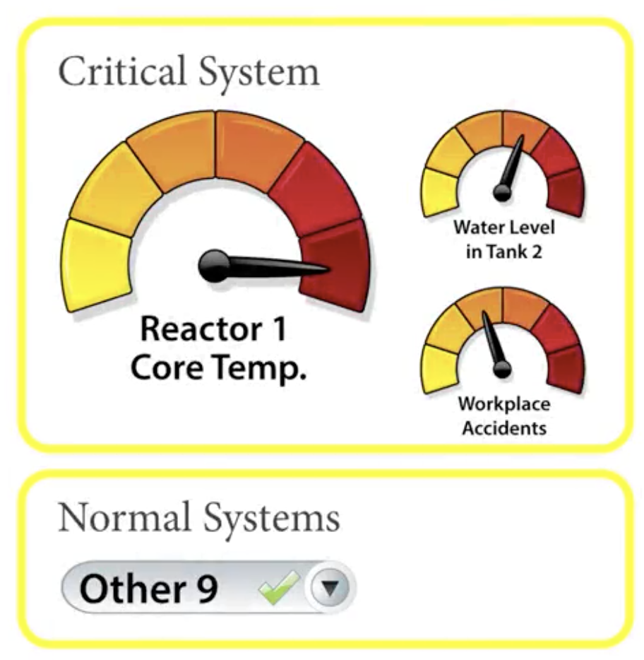
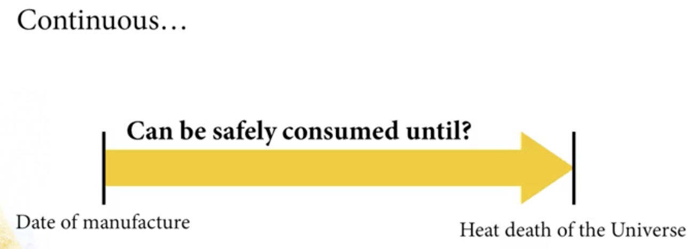

# Design For Understanding

## Design For Understanding Introduction
Making sense of large multidimensional data set are: 
- tasks for encoding, arranging and presenting data to reveal meaningful patterns and stories for audiences; 
- keep the brain in mind when designing visualization; 

There are two systems: 
- System 1: involes automatic and relatively immediate perception; 
- System 2: is a solver and more deliberative thought process; 

Designing visualizations that work best for the target audience: 
- As you create your visualizations, think of yourself as a kind of architecture! 
- Your basic building materials include visual encoding elements such as color, shape and size;
- Assemble visual encoding elements to leverage user's perceptual abilities;
- As an architecture, you need to consider factors ranging from construction materials and location to people and the purpose for which the building is intended; 
- Designs may begin with visual perception principles (Proximity, Similarity, Enclosure, Closure, Connectivity) but need to finish with a clear and acurate depicition of data; 

## Know your audience(s)
- Data visualizations come in a wide and expanding range of forms, have many different purposes and have diverse sets of potential audiences;
- Discover considerations for user-centered design including audience, purpose and representations
  - Analysts who need to comb through data to find interesting patterns, trends and anomalies;
  - Executives who need quick, clear, and reliable summaries of some initiatives or campaingn;
- Consider about levels of information density and detail that fit for targeted audience: one size definitely does not fit all; 
- Knowing your audience means:
  - Recognizing simplicity is relative to your audience; 
  - Thinking about audiences (purposes and context) for your data visualization; 
  - the purpose for visualization and the types of data being used; 
- Good visualization design means effective communication with your audience (needs, skills, knowledge and goals); 
- Few fundamental questions to keep in mind at the outset: 
  - What are the interests, needs and goals of your audience? How will your visualization meet those needs? 
    - Audience needs can range from curiosity to urgent real-time alerts such as 1- the relationships of life expectancies and personal income levels in different parts of the world; 2- a specific need like seeing a real-time alert about a potential hacker intrusion to a network; 
  - What level of familiarity should your audience have with this subject? What level do they actually have? (novice, user, expert). Prior knowledge can sometimes help and other times hinder the ability and usability of design; 
  - What level of detail and information density that fit targeted audience? Too much or too little detail are both counterproductive - depending on who's looking at the visualization; 
  - How much control do users have? More user control may require more effort and knowledge from the user. A potential trade-off here is that control can require more effort and knowledge from the user. Simplicity is relative for different types of users; 
    - *Retail analysts* may need tools to discern patterns and trends in the data. Their goal is to faciliate user's ability to explore the data; *Sales presentations* will have different goals: conveying specific information (such as quarterly returns to executives) as concisely as possible;
- Detail is also relative but it help us to guide the design strategy: 
  - Time scale needs can vary amongst audience members: in case of the analyst, she/he may need the ability to easily view data in various time scales from  days to years, whereas a sales person may only need to show quarterly results;
- Personas are collections of user types that capture characteristics, goals, and needs of different types of users:
  - a persona that represents a retail analyst and another that represents a sales person; 
  - personas may not be useful for every design project, they can provide useful summaries of important people types that can help sharpen thinking about targeted design; 
- Key things to remember: **Ask questions <-> Adjust design <-> Use personas <-> Understand and anticipate audience's needs**;  

## Design for Purpose
- Question: is the primary intention to highlight something you've already found in the data or perhaps to enable the discover of things, as yet unknown? Where does it fall in the spectrum between exploration and explanation? 
- Firstly, we need to do the task of comparing and contrasting exploratory and explanatory: 
  - If the purpose is exploratory, then the visualization will often need to provide users with more direct control and interactivity for the analytic process and those users also probably come with prior knowledge about the data they are seeing; if the purpose is explanation, direct control and interactivity and prior knowledge are not needed; *The key is to define and discuss levels of interactivity*;
  - Depending on the context and users, providing either too much or too little detail can be counterproductive. *Information density and details that fit the target audience* are two key thing in this case; 
- Along with thinking about key *characteristics of audiences*, you need also to consider the *context and purposes of your users*
- Are users exploring data, communicating findings, or both? Will the visualization be used to explore data or to convincingly explain something already discovered to different people or perhaps some combination of both? *These questions help you clarify design strategy*
- General framework for determining a visualization's context
  
- If audience's goals are exploratory: visualization and interface need more user control (filtering, pivoting, zooming). In this case, you might expect user to
  - Have more prior subject matter expertise; 
  - Be motivated to find answers; 
- Explanatory visualizations are simpler and do not require the audience to have prior subject matter expertise. It maybe something as simple as making a case or statement in an infographic. It all comes down to: 
  - Have a clear message; 
  - Quickly get to the point; 
  - Not open-ended discovery or iteractive investigation; 
  - Make them clear, crisp and compelling by showing key ideas;
- Another related factor included in the graphic is the relationship between dynamic and static data visualization:
  - What level of interactivity does the user have? 
  - Can the user change views? 
  - For example, with a network visualization, a cybersecurity investigation tool can be highly interactive with all kinds of options for user to expand, hide filter, and sometime modify what the visulization is showing. In this latter case, the user's direct engagement with the visualization is necessary to reveal stories in the data; 
- A printed infographic is a static or a read-only visualization; Dynamic visualization has a stepper learning curve for the user, but static visualization maybe exactly what's needed for the context;
  - Static visualization can have a lot of complexity and depth for people to study and explore. But in general, more complex and deep visualization benefit from interactivity at least on some level; 
- There is a balance point between complexity and decluttering a visualization. One way to do that is to consider the use of progressive disclosure: showing things only as needed based on factors such as context, urgency and criticality. In other words, only show the amount of data that is useful at a given moment, in a use case or a scenario; 
  
- Everything being monitored is displayed at the same level of visual hierarchy
  
  - A potential problem with this approach is that any malfunctioning system indicators may get lost admist all the dials and controls, and visualization for properly functioning systems. 
  
  - An alternative approach for a system monitoring display that helps alert users to problem as quickly and easily as possible is to design a view that shows data about something that has surpassed a level of criticality with a larger and more detail visualization while considering and summarizing the things that are running normally and properly; 
  
    - Users can view normal systems;
    - Systems of immediate concern are emphasized;
    - Simplicity is relative and depends on user's expertise and needs; 
> Simplicity is not the absence of clutter, that's a consequence of simplicity. Simplicity is somehow essentially describing the purpose and place of an object and product. The absence of clutter is just a clutter-free product. That's not simple. 

**People create visualizations for many purposes. Purpose dictates the visualization's design**

## Data, Relationships and Design 
- You need to consider the context and potential workflows for your audience; 
- Some consideration: 
  - Recoginze that charts and graphs work with only certain types of data; 
  - Consider the best way to reveal relationships among different dimensions in data. These relationships each have corresponding data types and design options associated with them. You need to keep in mind of choosing the correct graph for the right data relationship; 
- For example: 
  
  - Showing changes over time: line chart; 
  - Displaying the relationships and categorical data: bart charts; 
- While designing visualization, think discrete means think bars among other options; 
  - Use case 1: What is the proportion of apples and oranges sold at Fruit Stand or the proportion of apples vs oranges at Fruit Stand at a particular date; 
  
    - Bar chart is one good option, but a trend line wouldn't work at all; 
    - The numbers of apples and oranges are discrete data, they are very distinct and distinguishable items; 
    - It's either an apple or an orange, there's no range (spectrum) between two;  
  - Use case 2: If you flip a coin, u can count and compare the number of heads and the number of tails, but there's no intermediate heads tails range between the two possibilities; 
- Another type of data called continuous which is a connected range of values. A line is the more appropriate choice to show this sort of trajectory; 
  
  - Use case: There's a popular backed good called the Twinkie that has notoriously long shelf life in the package. How long a Twinkie be safely consumed and how can that be shown? 
  - That's a very indiscrete question it can be measured and displayed in a line starting from the date of manufacture and continuing to some point in the distant future; 
- Few primary types of relationships and associated charts:
  
- Making visualization decisions based on: Data Type - Relationships within the data - The needs of intended audience; 

## Static versus interactive visualization
- The contexte and interaction workflow of visualization will have important impact on design of your choices; 
- The level of interactivity can depend on whether the primary purpose is to explain the already know or uncover meaningful and important unknow; 
- If the visualization is static, such as an infographic poster, then it's essential to think very carrefully about what data is and is not being displayed, because there are no way to adjust the view of the final results; 
- Interactive visualizations with controls like filtering and zooming give you a lot more options:
  - More interactivity requires users to think and decide how to view th data; 
  - Large data sets can generate messy visualizations because of theirs complex relationships; 
  - Example: network diagrams can quickly turn into confusing tangles of lines and shapes; 
- Within the activity workflow, you can begin with a big picture view and drill down to a lower level detail. You can reveal multiple details within the same workflow interface. There are some tools to untangle the data: filtering and zooming; 
- Interlocking feedback loops: 
  - **Direct manipulation of graphical objects** is the ability to interact with various visual elements representing data. 
    - The visual elements serve many roles:
      - hover/roll-over provides additional details
      - input mechanism
      - pivot point for new exploration
      - Example: selecting a node in a networks diagram to tag and save or to use as the focus in pivot point for a new investigation. These kinds of interactions are commonly done with clicks, right clicks, and small transient menu;
    - Direct data manipulation should have a purpose and meet the need of users: 
      - In some visualizations such as stacked column charts and bubble graphs, it can be extremly difficult to precisely select and interact with a data point of interest because it's crowded out or covered over by nearby visual elements; 
      - Sometimes, the issue is that the visual element of interest presents only a very small or ambiguous selectable target area. Techniques such as outlining a particular selected area or highlighting it on rollover can be helpful to address this as well as the ability to zoom in and out of a particular spot;  
  - **Exploration and navigation** lets users quickly find information; The interface should help users enter, orient themselves, move toward (get where they want to go) or discover useful pathways ahead and anticipate it; 
    - It's important for people to *navigate through an interactive visualization* and to keep *context from the starting point* and know what the *options available* as they move through different pathways. Sometimes, they want to go back to a previous point in an analytic process; 
  - **Problem solving and question generation and workflow maps and story boarding** helps us to design useful visualization; 