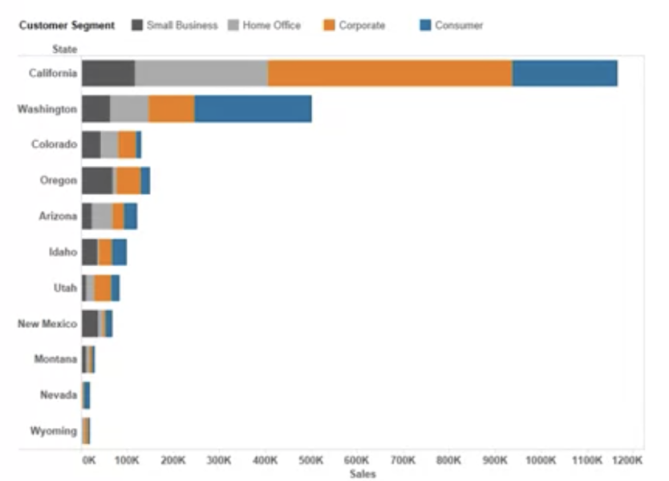

# Getting Started and Charting

In this module, you will explore the topic of charting in Tableau. By now you should already be well versed in how to change colors, shapes, and sizes of charts, so we are going to practice and demonstrate that skill more. You will be able to explain what the Tableau Tooltip does and when to use it. You will be able to discuss the various guidelines for choosing the right chart for your data. 

- List of various kinds of charts;
- Demonstrate how to change colors, shapes, and sizes of charts; 

## Visual Analytics with Tableau Introduction
- Introduce charts in Tableau and their particular uses; 
- Making changes on charts; 
- Using multiple charts together; 
- Using Tableau Tooltip; 
- Selecting the best chart for your data; 
- Module 2 - Introduction to dates
  - Using dates in Tableau; 
  - Discrets vs Continous dates; 
  - Understand date hierarchies to drill down into timelines; 
  - Converting date types; 
  - Creating date variables with calculated fields;
- Module 3 - Introduction to table calculations
  - Using table calculations in Tableau;
  - Creating new fields;
  - Making custom table calculation; 
  - How calculations impact data; 
  - Apply filters to create data parameters; 
- Module 4 - Introduction to mapping
  - Mapping in Tableau; 
  - Geographic data recognized by Tableau; 
  - Using color, shape, size with mapping data;
  - Creating custom geocodes; 
  - Customize maps to use location data that is not recognized by Tableau; 
  - Using overlays and multi-layer maps; 

## Introduction to Charting
- Expading on the various types of charts that Tableau allows you to use to explore and explain your data and how to choose an appropriate chart for various situations; 
- Changing the colors, shapes and sizes or other chart elements;
- Creating duel layer charts. This section will showcase how to overlay multiple charts on top of one another;
- Explaining what the tooltip does and when to use it; 
- Guidelines for choosing a chart appropriate to your data;

## Tableau charts
- Tableau offers guidance on which chart type is best suited for the data you're trying to present;
- Chart types that are not applicable to your worksheet as it's currently constructed will be grayed out and not selectable until you have the appropriate combination of measures and or dimensions; 
- Identify questions you should ask before choosing a chart type and determine the purpose for your visualization: 
  - Who is your audience?
  - What are their questions?
  - What information do you want them to know?
  - What other questions might your visualization inspire? 
  - What idea will your audience take away after using your visualization? 
  - What is the right chart for your particular visualization according to the specific insight? 
- **Text table**, also known as the cross tabs, is essentially same view you would see from Excel data source. The data is organized simply into rows and columns; Text table is not recommended as a primary visualization in your report - consider using them as an appendix inclusion for those report consumers that want more detail in a traditional format;
- **Heat map** is a great way to compare categories using color and size.
  
  - Gradient colors show strength or weakness of trends; 
  - Use heat maps to show the correlation between two factors: 
    - Segmentation analysis of a target market; 
    - Product adoption across regions; 
    - Sales leads by individual sales representatives; 
  - Varying the size, colors and shapes in heat maps may help convey data with more impact; 
- **Highlight table** allows us to apply conditional formatting to a view .Tableau will automatically apply a color scheme in either a continous or stepped array of colors from highest to lowest. It's great for comparing a field's values within a row or a column; 
  
  - Combining highlight table and other chart types help users to understand overall trends and specific cross-section of data; 
- **Symbol maps** are simply maps that use a type of mark such as a field circle to represent a data point; **Infield maps** use shading on a country or state basis to indicate relationships; 
  - Use maps when you have any location data: postal codes, state abbreviations, country names,...
  - Here are some guidelines while using maps: 
    - State insurance claims;
    - Product export destinations by country; 
    - Auto accidents by postal code; 
    - Custom sales territories; 
  - Use maps as a filter for further types of charts, graphs and tables; 
    
  - Layer buble charts on top of maps
    
    - Buble charts represent the concentration of data and their varied sizes as a quick way to understand data; 
    - By layering bubles on top of the map, we can interpret easyly the geographical impact/relationship of different data points; 
- **Pie charts** are best to show proportional or percentage relationships; Pie chart is used with only fews wedges; 
- **Horizontal/Vertical bar chart** makes quick work of information consumption for the report viewer. It's a common way to visualize data allowing *quick comparisons by revealing highs and lows at glance*; 
  - It's also effective when you have numerical data that splits nicely into *different categories*, so you can quickly see *trends/performance* within your data; 

  

  - Example guidlines for when to use bar charts: 1- Volume of shirts in differents sizes; 2- Website traffic by origination site; 3- Percent of spending by department;
  - Adding color to bars imparts more impact and can provide immediate insights; 
  - Combining bar charts with maps and Setting the map to act as a filter, so when you click on different regions, the corresponding bar is displayed; 
  - Putting bars on both sides of an axis, you can show both positive and negative trends of a performance; 

- **Stacked and Side-by-Side bar charts** are great for adding another level of detail inside of a horizontal/vertical bar chart; These representation help us to answer multiple questions at once - Displaying related data on top of or next to each other gives depth to your analysis and addresses multiple questions at once; 

    

- **Tree maps** are ideal for legibly showing hundreds or even thousands of items in a single visualization simultaneously. Using a tree map you can immediately show the landscape of performance. This view is very similar to a heat map, but the node are gathered by like in the hierarchy of dimensions you have defined; 
  
  

  - Tree maps show users how parts relate to the whole; 
  - These charts use a series of rectangles nested within other rectangles to show hierarchical data as a proportion to the whole; 
  - Through each rectangle size and color, you can see the patterns across parts of data, such as whether a particular item is relevent, even across categories; 
  - Some guidelines: 
    - Storage usage across computer machines; 
    - Managing the number and priority of technical support cases; 
    - Comparing budgets between years;
  - Combining tree maps with bar charts to see proportional relationships simultaneously
  

- **The circle view chart** is another visualization for comparative analysis. It's similar to a stack bar chart but with different shapes for each region; 
- **The side by side circle view** is a variant of the circle view allowing you to add more measures to be compared next to each other for a richer analysis; 
- **Lines chart** connects individual numeric data points. It's ideal for when you want to illustrate trends over time or visualize a sequence of values; 

    

  - Guideline while choosing line charts: 
    - Changing stock prices over five-year period;
    - Website views per month;
    - Quarterly revenue growth; 
  - Combining a line graph with bar charts shows trends for 2 types of data - A bar chart indicating the volume sold per day of a given stock combined with a line graph of the corresponding stock price can provide visual queues for further investigation; 
    
  - Shading under line charts provides information about the relative contribution that each line gives to the whole; 
    
- **Dual line chart** is also referred to as a dual axis chart. It's an extension of a line chart with one notable exception allowing more than one measure to be represented with two different access ranges; 
- **Area charts**, both for continous and discrete values, are combination between a line graph and a stacked bart chart. It shows relative proportions of totals or percentage relationships; 
- **A scatter plot** is useful to investigate the relationship between different variables:
  
  - Scatter plot gives you a high-level sense of trends, concentrations and outliers; 
  - These can direct your investigation's next step; 
  - Some guidline while using scatter plot: 
    - Likelihood of getting cancer by age and gender; 
    - Purchasing patterns of cell phones by technology over time; 
    - Shipping costs of product categories to different regions;
  - Adding trends lines to the scatter plots chart to show correlations among data; 
    
  - Using filters with scatter plots to show data in different ways; 
    
  - Vary your scatter plot mark types with data-relevant shapes; 
- **Histogram** leverages the distribution of data across groups;
    
  - For example, that you've got hundred pumpkins and you want to know how many weigh two pounds or less, 3-5 pounds, 6-10 pounds,...; 
  - Experiment with different data groupings to balance each group's size; 
  - By offering a way for the viewer to drill down/filter into different categories of data, the histogram becomes a useful tools to explore many data views quickly;
- **Box and whisker plot**
  
  - The box represents the values between the first and the third quartile known as the interquartile range; 
  - The whisker represents the distance between the lowest value to the first quartile and the fourth quartile to the highest value; 
  - Guidelines to show the distribution of a set of data: 
    - Understand your data set a glance;
    - See how data is skewed towards one end;
    - Show outliers in your data and consider hiding the data points within the box to focus user on outliers; 
    - Compare box plots across categorical dimensions to see distributions across the data;  
- **Gantt chart** is invented as a way to visualize a schedule or progression of time. Since then, the Gantt chart has become a staple of project management methodology. Each task can be planned as an individual data point with interdependencies on other task or resources; 
  - Resource planning - For how long it took people to hit specific milestones, such as a certification level and how that activity was distributed over time; 
  
  - Some guideline while using Gantt chart: 
    - Display a project's schedule; 
    - Show deliverables, owners, deadlines; 
    - Resource availability or lifespan;
  - Use the colors in Gantt chart to highlight key variables; 
  - Use Gantt charts with maps or other charts in a dashboard to filter details;
- **A bullet graph** is a very powerful way to compare data against historical performance or pre-assigned thresold/target. 
  
  - Bullet chart is used to track progress toward a goal; 
  - Bullet chart is a variation of a bar chart. It's designed to replace dashboard gauges, meters and thermometers; 
  - Use a bullet chart to evaluate performance of a metric against a goal:
  
    - Sales quota assessment 
    - Actual spending vs. budget; 
    - Performance over a spectrum: great, good, poor; 
  - Add colors to bullet charts to show achivement thresholds; 
    
  - Add bullet charts to dashboards to summarize insights; 
  - Combine bullets with other charts to support discussion about reaching objectives; 
  
- **Bubles charts** show relational values without regarding to axis. It's used to accentuate data on scatter plots and maps. Varied size and colors of circle convey meaning about data; 
  
  - Sales by product and geography;
  - Class attendance by department and time of day; 
- Some **general** guidelines: 
  - The goal is to emphasize the most important data; 
  - Rules of thumb: many charts allow you to put many measures or dimensions in one view, but put the most important data on the X or Y axis; 
  - Use color, size and shape to convey less important data; 
  - Rotate your charts and labels for easy reading; 
  - Do not overload your view - less is more; 
  - Break information into small multiples; 
  - Use color and shapes thoughtfully to help the user see patterns - again, less is more; 