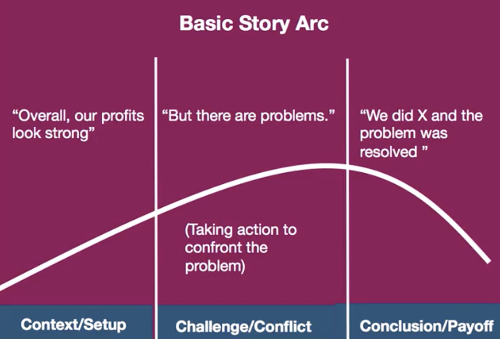
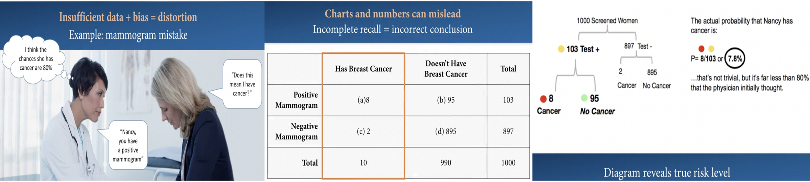
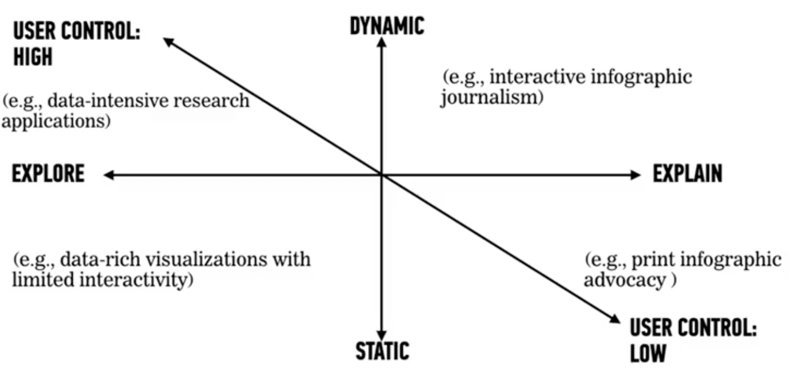

# Getting started - What is a story? 
- As human beings are wire for visual perception, we're also wired for stories; 
- Storytelling is an ancient and powerful tool for communicating ideas; 
  - Leveraging power of storytelling; 
  - Define what makes a good story; 
  - Identify potential pitfalls of storytelly and apply the *3-C* of basic story arc;
- In many ways, data stories are the inverse of data analytics and require different approaches to be fully successful while the kinds of visualization design for analytical work should generally be geared to support users in their exploration of a range of possibilities and patterns in the data to derive their own insight; 
- Stories direct the audiences attention to a predetermined point or message; 
  - Visualizations for analytics exploration are like being in forest with a compass; 
  - Data story visualizations are like being in forest with a trail marked out for you; 
> "I find that most people know what a story is until they sit down to write one"
- One foudation description of a story is something has three core connected elements: **Context - Challenge - Conclusion**
- Stories are essentially focused accounts of change and how and why that happens.
> "Data tells you what's happening, stories tell you why it matters"
- Example of proto-story and map it into a story arc

  - Story arcs can include all kinds of additional subplots, steps, complications or permutations but the fundamental structure is still essentially the same; 
- Some pros of using stories: 
  - Stories improve comprehension and recall; 
  - Stories evoke empathy and emotions; 
  - Stories engage more of our brain's capacity than simply looking at the numbers alone; 
- Some cons of using stories: 
  - Can distort data with meaningless pattern;
  - False narrative; 
  - Seeing patterns lead to false conclusion; 
- Some guidelines: 
  - Making stories clear, concise and accurate is a crucial skill; 
  - Be selective; 
  - Eliminate detail that are meandering, meaningless or misleading; 

# Planning and pre-production: Algning your audience, Stakeholder and Data

## Introduction
- Build basic story framework;
- Pre-plan who, what, why and how of the story; 
- Interview stakeholders and audience to find the story in your data; 

## A Design Checklist of Who - What - How

## Start with Stakeholder
- Stakeholders represent the business questions in every project; 
- Becoming a great story teller means: 
  - Cultivate critical thinking and empathy; 
  - Ask questions; 
- Stakeholder can help: 
  - Refine drivers for doing the visualization; 
  - Provide the key requirements and purpose; 
  - Provide the details about data available; 
  - Identify and clarify audience characteristics: to persuade an audience, to open up a conversation, to enlighten and inform; 
- At the starting point for further investigation, you can ask the stakeholder about: requirements - source materials - goals; 
- Note your perspective on the data: 
  - Level of domain knowledge on topic; 
  - Implications for interpretation; 
  - How describe features of data set; 
- Starting set of items to consider while processing a stakeholder interview: 
  - Which elements details and result must story include? 
  - What's the timeline? For example, 2 weeks to work on it and 5 minutes to present it; 
  - Summary of point and goal of data story; 
  - Benchmarks or metrics to measure success; 

## Addressing your audience and their context

> - Identify needs of your audience; 
> - Tailor data story for maximum impact; 

- Firstly, you need to know your audience: 
  - Level of understanding of subject; 
  - Reason for viewing story; 
  - Context for viewing; 
  - Intended takeaways; 
  - Choose visualization based on audience sophistication;
    - For example, a general audience may find a box plot to be baffling but for an audience with a more sophisticated knowledge and need for statistical decision, it might be the perfect choice; 
  - Consider various audience segments; 
- There are 2 fundamental approaches to get a sense of your audience: 
  - **Quantitative** including surveys to capture common patterns in potential audience; 
  - **Qualitative** including personas to help you get a better real-world sense of the people who will be looking at your data story about: 
    - Big picture background view; 
    - See design from different perspectives; 
    - Create personas based on solid research; 
- What are personas: 
  - Concise, concrete description of each type of audience member; 
  - They are highly specific archetypes representing a particular user segment that can help you prioritize design requirements; 
  - A key part of the persona description is a list of needs and goals illuminating details and making them believable and relatable; 
- Interviewing a target audience segment: 
  - Don't ask leading question at outset - don't 
  - Ask open-ended questions; 
  - Ask about needs, goals, pain points and their level of understanding; 
  - Don't start by showing an interviewee a visualization prototype, explaining in a lot of detail and then asking what's great about it. In that situation, it becomes impossible to determine what the user truly understand; 
- Few question assessments that can help you optimize your visualization for the audience: 
  - What's their knowledge of subject?
  - What's their familiarity with data displays? 
  - In what context or platform will they view data stories? 
  - How often will it be referenced?
  - With whom may they share it? 
- Later-level interview options: Okay to show a few design idea after open-ended questions and answers; 
- The context or scenario in which your audience will be viewing the story is a key consideration: 
  - Presentation in a meeting with a large and varied group with a set of different personas, or will it be a very narrowly focused group?
  - How do you determine the most effective level of detail to show? 
  - How much interaction is there with the presenter and the visualization?
  - How long is the story?

## Finding the story
- Finding the story means: 
  - Recognize your predisposition to seeing narrative of all kinds; 
  - Analyze data and decide what to pursue; 
- Some questions to consider about data at the outset: 
  - What types of data?
  - What's data story and completeness?
  - What are the most relevant dimensions of data? 
  - How fresh and frequently is data updated? 
  - What kind of actions or decisions might arise from the data story that you are going to be telling?
- Check expressiveness and effectiveness of data:
  - Does data accurately express the story? 
  - Doese presentation style effectively convey meaning of data? 
  - This guides decisions to include or exclude? 
- Ask the right questions at the outset: 
  - Not all patterns make true stories; 
  - More data, more risk of false narratives; 
- Data maybe incomplete at the outset, finding a true story is a process of: 
  - Weighting and evaluating available data; 
  - Working to fill gaps; 
  - Relevance may shift with context; 
- All needed data may not be available at start: 
  - Irrelevant data could turn out to be essential; 
  - Data that may seem true could be false;
  - Test data against various factors and other data; 
  - Seeing different possibilities can clarify thinking; 
- Example of distortion
  
  - **Context**: Nancy has a positive mammogram
  - **Challenge**: Determining what the results mean;
  - **Conclusion**: Chance of cancer 8% but not 80%;
  - **Moral**: Good story requires bias alert;

## Prioitizing, Optimizing and Designing data story
- Once you've obtained the key information to help in planning and pre-producing of your data story, it's time to think about how to put that information together for your final deliverable; 
- The stakeholder's goals, the inteded audience's interests and the data that you're working with to not perfectly align:
  - Apply pre-production concepts to data story to set design priorities accordingly; 
- Check-list to find the most effective presentation:
  - What's the purpose and context?
  - Is aim to persuade to your conclusion? 
  - Is the story to start an open-ended discussion? 
- Perhaps the conclusions from your data story are unexpected or inconclusive:
  - Short-time: use well defined story arc;
  - Longer time: deep dive on more open-ended narration, with some interactivity and more details; 
- Any consideration can range from a lightly scripted narration of an interactive dashboard to a tightly scripted, printed or a slide show; 
  