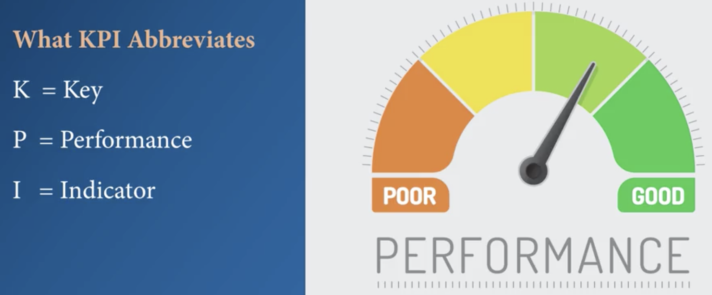

# Key Metrics, Indicators, and Decision Triggers

- Identify metrics to answer business questions; 
- Understanding the ways KPIs can be visualized using Tableau; 
- Set thresholds and alerts to trigger decisions; 
- Discuss quality and constraints of the data; 

## Key Performance Indicators - KPIs
- In the business world, KPIs are a measure of how well companies, business, businss units, products, projects or individuals are performing compared to strategic goals and objectives; 
- Well designed KPIs provide the navigational tools to understand their importance and what they can do strategically for a business; 
  
- KPI comes from organization strategic and business plan; 
- KPI is about tracking the actual performance as compared to the goal. For example, let's say one of the key goal of this year is to improve profit from last year. You'll measure the key value of actual performance or profits of this year. 
- KPI leads us to some ways to indicate how the performance is keeping up with the goals. The indicator will flag any performance that falls outside the bounds you have set and notify you quickly. The indicator should use pre-attentive attributes that will allow the user to access their iconic memory space or more likely short-term memory space. 
- Three components of a KPI:
  1. It must be crucial or key;
  2. It must be measurable; 
  3. It must have some calculation; 
- Some important design tips: 
  - Design based on strategic need; 
  - Make sure KPIs are well defined, measurable and quantifiable; 
  - Make sure KPIs are set for crucial business goals; 