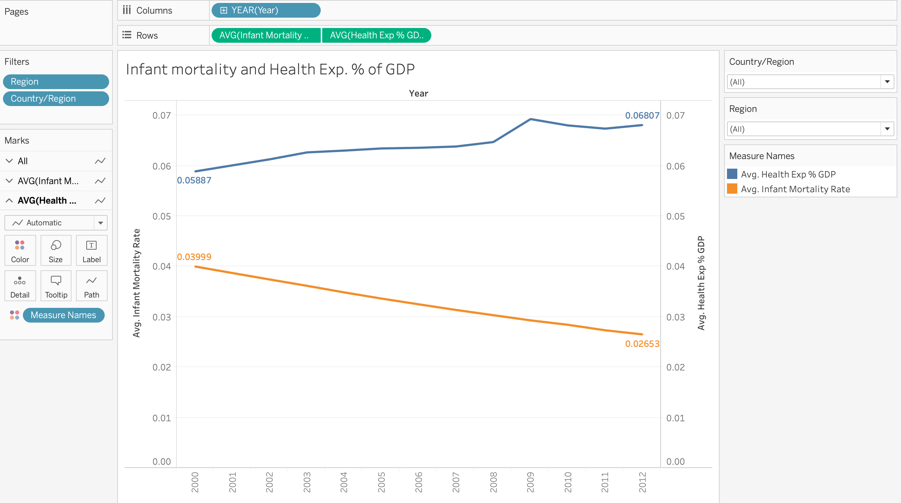

# Best practices for dashboard design

- **Use case 1**: Develop a metric that illustrates the relationship between infant mortality and a country's health expenditure as a percentage of GDP. 
   
  - **Choosing metrics based on why they matter**: This visualization uses information about year, infant mortality rate, health expenditure % of GDP, country, region; 
  - **Keeping it visual**;
  - **Making it interactive**: the visualization has filters and allows you to drill down and examine the underlying data. However, you need to *balance* how the visualization is shown with the interactivity. In this case, it choose to show "Only Relevant Values"; 