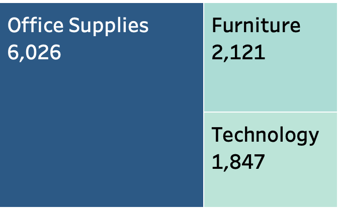
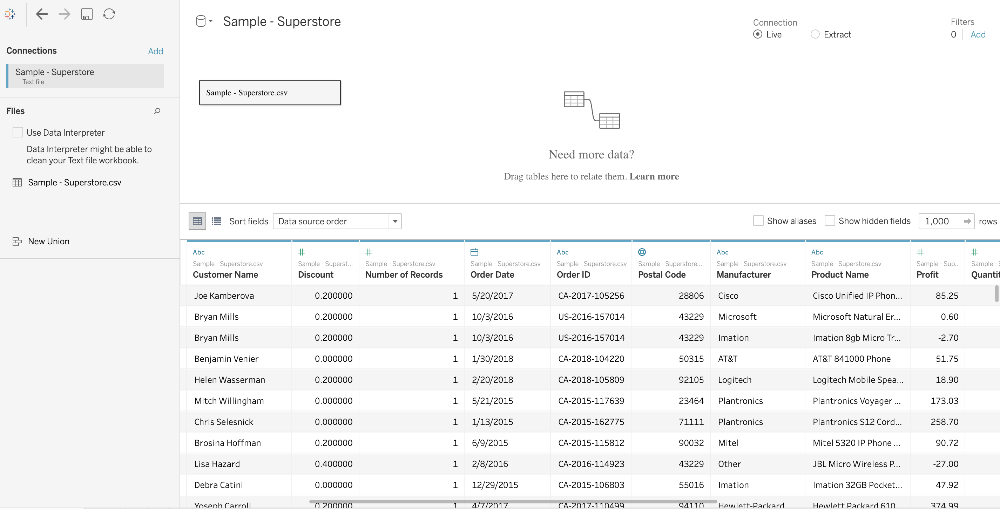

| Data Source                                     	| Sample Data set in Excel format   (Global Superstore.xls)                                                                                                                                                                                                                                                                                                                                                   	|
|-------------------------------------------------	|-----------------------------------------------------------------------------------------------------------------------------------------------------------------------------------------------------------------------------------------------------------------------------------------------------------------------------------------------------------------------------------------------------------	|
| Time framing of data                            	| Data set includes sale data so that order dates are specified in 2015, 2016, 2017 and 2018;                                                                                                                                                                                                                                                                                                               	|
| Key Data Points                                 	| - Sales, Discount, Order date, Profit, Geography - Category and Sub-Category and Segment of the product on sale - Shipping status and Shipping date of the order                                                                                                                                                                                                                                    	|
| Data features to answer predetermined questions 	| - Aggregation of Sales and discount data; - Relationship between discounted sales and profit; - Correlation of geography and time frame to discount; - Relationship between Customer discount preference (category, sub-category of the products); - Comparison of more or less profitable sales based on profit ratios; - Inventory and distribution decisions based on profitable sales; 	|

## Overview 

Data set includes sale data so that order dates are specified in 2015, 2016, 2017 and 2018. The total number of records is about 9994 according to the number of orders overs the last 4 years. 

| Year | Number of orders |
|------|------------------|
| 2015 | 1993             |
| 2016 | 2102             |
| 2017 | 2587             |
| 2018 | 3312             |

## Data schema

| Column name   | Type    | Description |
|---------------|---------|-------------|
| category      | string  |             |
| city          | string  |             |
| country       | string  |             |
| customer_name | string  |             |
| discount      | decimal |             |
| order_date    | date    |             |
| order_id      | string  |             |
| postal_code   | integer |             |
| manufacturer  | string  |             |
| product_name  | string  |             |
| profit        | decimal |             |
| quantity      | integer |             |
| region        | string  |             |
| sales         | decimal |             |
| segment       | string  |             |
| ship_date     | date    |             |
| ship_mode     | string  |             |
| state         | string  |             |
| sub_category  | string  |             |

### Column: category - string

Column is of type string and doesn't have any null value. 

Sub-category, product_name, manufacturer, and segment are classified in the same hiearchy of product. These columns don't have null values or any outliers. The dataset is pre-processed. 

### Columns: Country-Region-State-City-Postal code

Columns are type of string in data set and geographical type in Tableau. They don't have any null values or outliers. It's data of United States classified in 4 regions of all american states. 

### Columns: customer_name, order_date, order_id, ship_mode and ship_date 

These are dimension columns related to orders. These columns don't have null values or any outliers. The dataset is pre-processed.

### Columns: sales, discount, profit, quantity

These are measure columns related to orders. These columns don't have null values or any outliers. The dataset is pre-processed.

