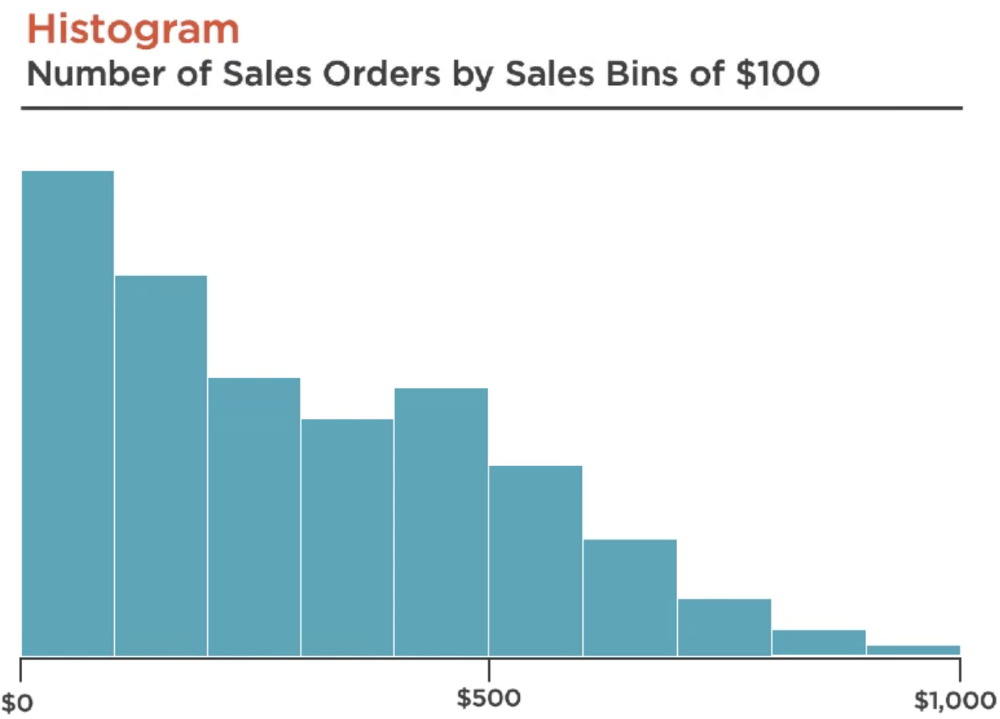
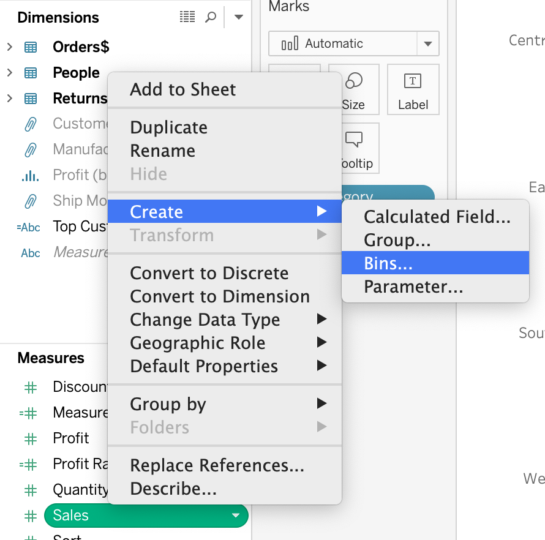
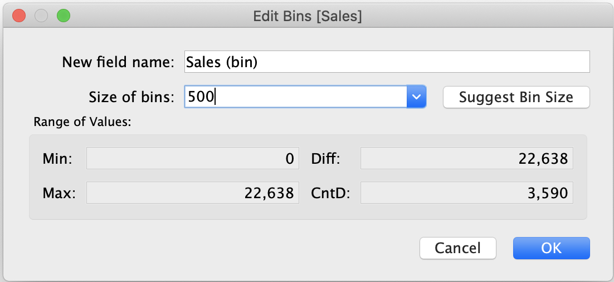
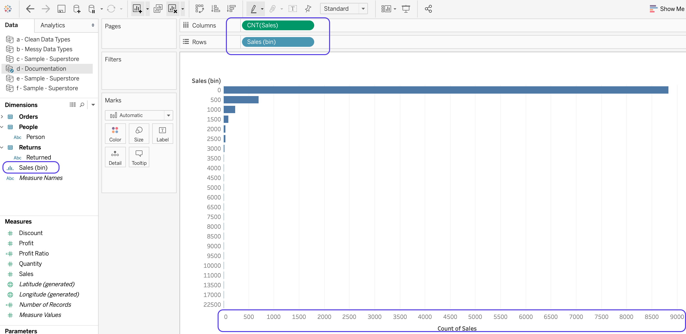
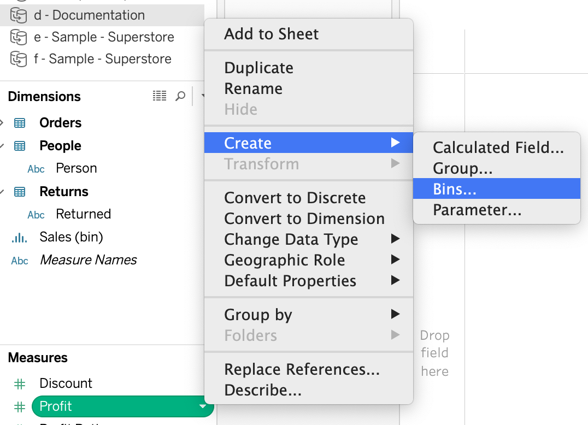
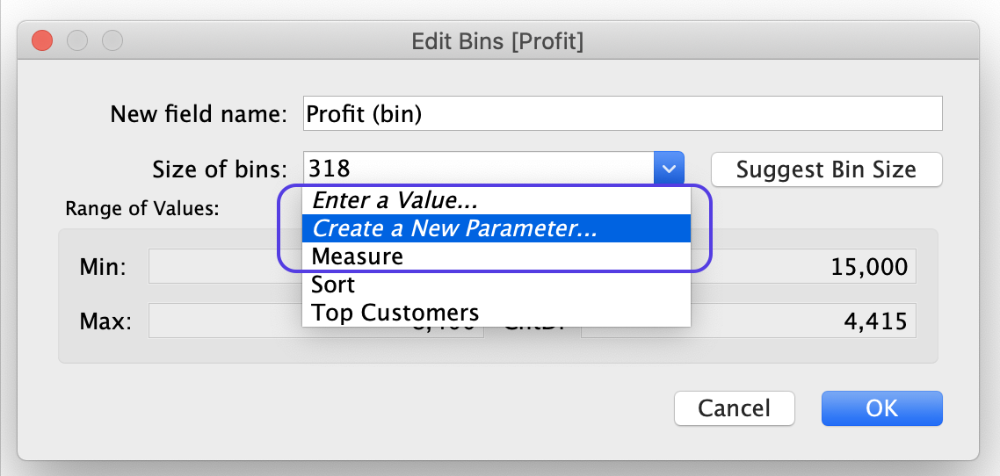
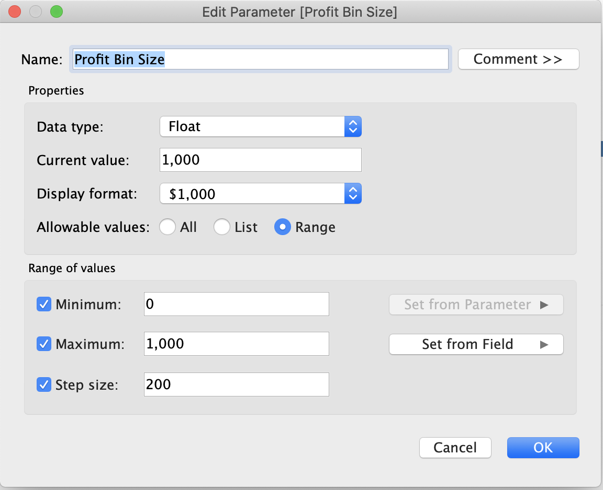
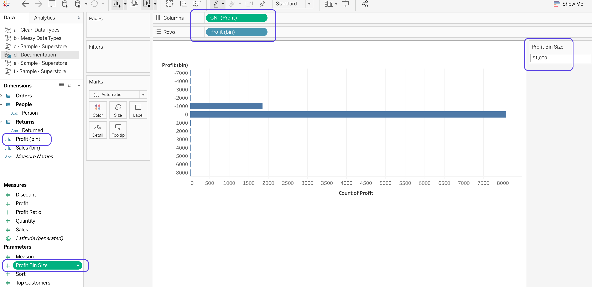

# Exploring Data - Creating Bin
- What is a bin? 
  - **Dimension created from a measure**;
  - We take our continous measure with an unlimited number of possible values and we chunk it into discrete bins that have a limited set of values by size: **each discrete value (a bin) has a limited set of possibilities**
- Why do we do this? To analyze a distribution: 
  - To see the shape and spread of the data; 
  - Look for missing values or gaps in our data; 
  - Look for outliers; 
- Example: We have (CntD: 1000) that total of $ X. The highest sales amount in those orders was (Max: $1000) and the lowest was (Min: $10). 
  - We have 10 bins of $100 and count how many of the 1000 orders are in each bin ($0-$99), ($100-$199), ..., ($899-$1000). The histogram bellow shows the shape and size of the distribution. 
  
- Demo - Creating bins for Sales and Profit measures: 
  - Creating bins for Sales:
    - Step 1: 
  
    - Step 2: 
  
    - Tableau creates a new dimension:
  
  - Parametrize bin size: 
    - Step 1: 
  
    - Step 2: 
  
    - Step 3: 
  
    - Tableau creates a new dimension and a new parameter:
  
  